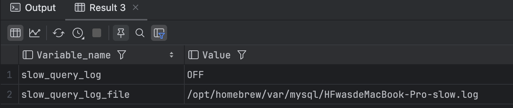
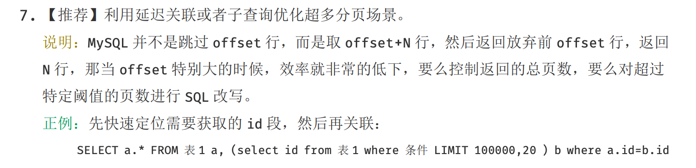

# MySql-常见的 SQL 优化手段

## 禁止使用 SELECT * 

- 使用`select *`消耗更多的 cpu 资源
- 使用`select *`占用更多的内存，特别是一些text,varchar比较大的字段，占用比较多的网络带宽，
- 推荐使用`select  <字段名称>`，只获取使用到的字段集合，不要获取全表字段

## 慢 SQL 优化

- 执行`SHOW VARIABLES LIKE '%slow_query_log%'`查看是否开启mysql慢查询日志



- 执行`show variables like 'long_query_time';`查看mysql设置的慢查询日志查询超时时间


## 慎用多表 join 

- 阿里云开发规范当中也体现

## 超多分页场景

- 阿里云开发手册如下：



- 优化操作
  - 查询条件放到子查询当中，子查询只查询主键ID，然后使用子查询获取到的主键ID集合去关联查询其他的字段
- 原理：减少回表操作
- 示例：

  - 使用子查询

  ```sql
  
  ```

  - 使用延迟查询

  ```sql
  ```

  - 使用覆盖索引

  ```sql

## 合理使用索引