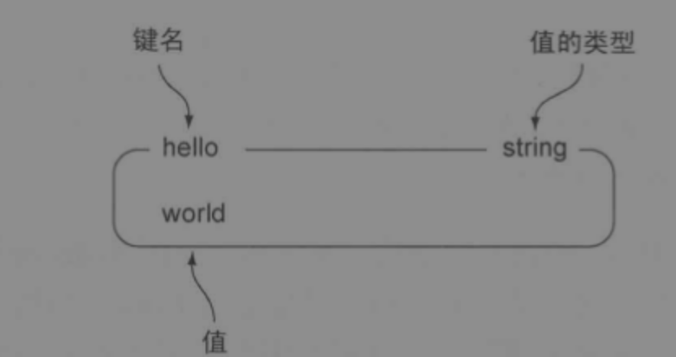
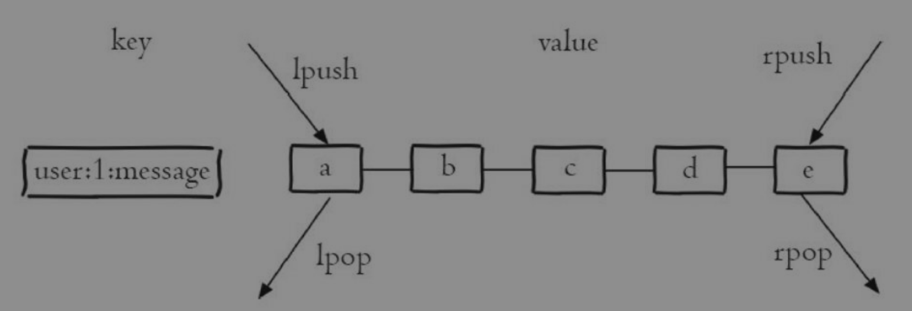
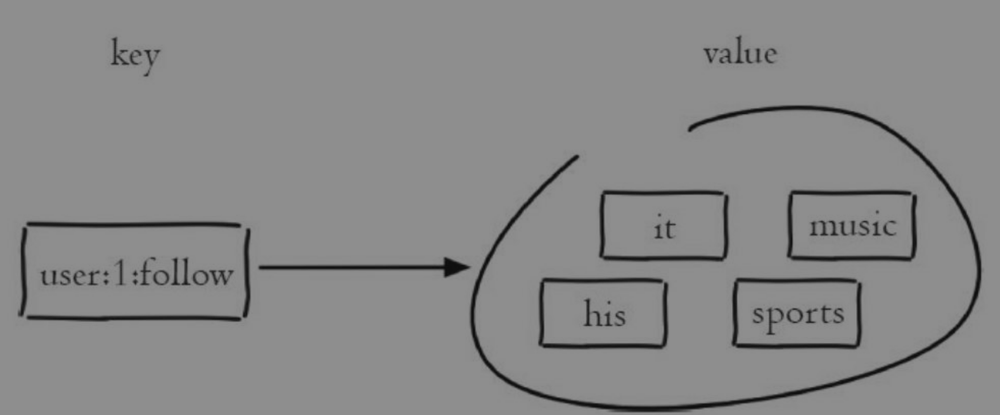
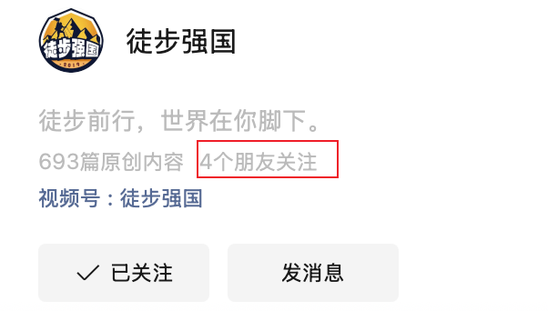
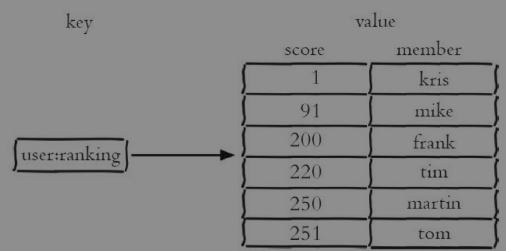

# Redis-五种基础数据结构

Redis的基本数据结构分为五种：

- String
- List
- Set
- Sorted Set
- Hash

这几种数据结构背后的实现有：

- SDS
- 链表
- 字典
- 跳跃表
- 对象

他们的对应关系是：

| String | List                        | Set              | Sorted set       | Hash              |
| ------ | --------------------------- | ---------------- | ---------------- | ----------------- |
| SDS    | LinkedList/ZipLIst/ListPack | Intset/HashTable | Ziplist/Skiplist | ZipList/HashTable |

## 字符串(String)

Redis当中最常使用的数据类型就是String，他可以存储字符串，序列化的对象数据，图片的二进制数据等等，



### 常用命令

| 命令          | 介绍             |
| ------------- | ---------------- |
| get key       | 获取对应key的值  |
| set key value | 设置key值为value |
| del key       | 删除key          |

### 实际操作

```bash
> keys *
system.mail.send
system.sms.send
> set hello world
OK
> get hello
world
> del hello
1
> keys *
system.mail.send
system.sms.send
```

### 应用场景

- 常用的存储序列化后的对象，分布式Session，Token，当前登录用户信息等等

## 列表(list)

可以用来存储多个有序的字符串，可以对列表两端进行插入和推出，也可以对删除指定位置的元素，获取指定下标范围的字符串集合



### 常用命令

| 命令   | 介绍                             |
| ------ | -------------------------------- |
| RPUSH  | 向列表右侧推入数据               |
| LRANGE | 获取列表指定范围的数据           |
| LINDEX | 获取列表给定位置上的数据         |
| LPOP   | 从列表左侧推出一个数据，然后返回 |

### 实际操作

```bash
> rpush hello-list value1
1
> rpush hello-list value2
2
> rpush hello-list value3
3
> lrange hello-list 0 -1
value1
value2
value3
> lindex hello-list 0
value1
> lpop hello-list
value1
```

### 应用场景

- 最新文章，最新关注，最近关注等等，
- 消息队列，使用lpush,brpop，生产者使用lpush从左侧插入消息，多个消费者使用brpop从右侧获取消息消费

## 集合(Set)

可以用来保存多个不重复的字符串，元素且是无序的，不能通过下标来获得元素信息，可以用来实现不同用户在某一个范围的交集，并集，差集效果，比如关注公众号共同关注人数等等



### 常用命令

| 命令                          | 介绍                            |
| ----------------------------- | ------------------------------- |
| sadd key value                | 添加key-value到集合当中         |
| smembers key                  | 查询集合当中元素格式            |
| sismember key value           | 查询集合当中是否存在value       |
| srem key value                | 删除集合当中key对应value        |
| sinter key1 key2              | 求多个集合的交集                |
| sunion key1 key2              | 求多个集合的并集                |
| sdiff key1 key2               | 求多个集合的差集                |
| sinterstore des_key key1 key2 | 求key和key2的交集存储在des_key  |
| sunionstore des_key key1 key2 | 求key1和key2的并集存储在des_key |
| sdiffstore des_key key1 key2  | 求key1和key2的差集存储在des_key |

### 实际操作

```bash
> sadd hello-set vaue1
1
> sadd hello-set value2
1
> sadd hello-set value3
1
> sadd hello-set value1
1
> sadd hello-set value1
0
> smembers hello-set
value1
value3
value2
vaue1
> srem hello-set vaue1
1
> smembers hello-set
value2
value1
value3
> sismember hello-set values1
0
```

### 应用场景

- 共同关注，
- 示例：比如微信公众号徒步强国，你的用户列表都有谁关注了这个公众号，取关注的交集，会显示四个朋友关注



## 有序集合(Sorted Set)

有序集合在集合的基础上，保留了没有重复数据，增加了数据有序的特性，增加了score参数来作为不同value排序的依据，注意：有序集合当中元素内容value不可以重复，但是score可以重复



### 常用命令

| 命令                            | 介绍                                 |
| ------------------------------- | ------------------------------------ |
| zadd key score value            | 向有序结合当中添加value              |
| zrange key index end withscores | 查询下表在index到end范围内的数据集合 |
| zrangebyscore                   |                                      |
| zrem                            |                                      |
| zrank key value                 | 分数从低往高排名，返回value的位次    |
| zrevrank key value              | 分数从高往低排名，返回value的位次    |
| zincryby key score value        | 增加key的分数score                   |

### 实际操作

```bash
> zadd hello-ss 100 value1
1
> zadd hello-ss 300 value1
0
> zadd hello-ss 200 value1
0
> zadd hello-ss 100 value2
1
> zadd hello-ss 300 value3
1
> zrange hello-ss 0 -1
value2
value1
value3
> zrange hello-ss 0 -1 withscores
value2
100
value1
200
value3
300
```

### 应用场景

- 排行榜，
- 比如微信运动的排行榜，按照播放量排行榜

## 哈希(Hash)

### 实际操作

```bash
> hset hello-hash key1 v1
1
> hset hello-hash key2 v2
1
> hset hello-hash key1 v3
0
> hgetall hello-hash
key1
v3
key2
v2
> hget hello-hash key1
v3
> hdel hello-hash key1
1
> hgetall hello-hash
key2
v2
```

### 应用场景

- 存储用户信息

## 参考

- Redis设计与实现