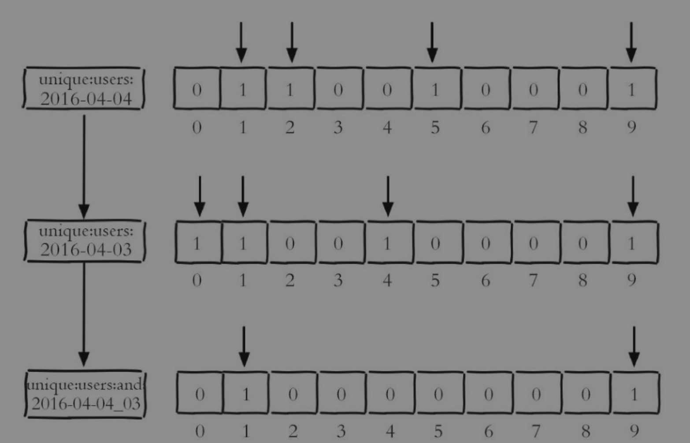

# Redis-三种复杂数据结构

- Bitmap：位图
- HyperLog：
- geo：地理信息定位

## Bitmap

Bitmap其实可以理解成一个map，map当中的key和value对应Bitmap的offset和value，但是Bitmap的value存储的是二进制数字，只有0或者1的选项

我们知道一个byte字节占用8个bit位，Bitmap当中的value只使用了一个bit位，这样可以极大的节省存储空间。



### 常用命令

| 命令                    | 介绍                              |
| ----------------------- | --------------------------------- |
| setbit key offset value | 设置key在offset位置值为value      |
| getbit key offset       | 获取key在offset的值               |
| bitcount key start end  | 获取key在start 到end范围为1的个数 |

### 实际操作

```bash
> setbit sign-bitmap-20250504 2 1
0
> setbit sign-bitmap-20250504 5 1
0
> getbit sign-bitmap-20250504 2
1
```

### 应用场景

- 网站上用户当天是否签到，是否分享视频文章，这种是否状态的信息就很适合使用Bitmap来存储

## HyperLog

使用HyperLog可以以极小的内存空间完成独立总数的统计，

### 常用命令


### 实际操作

| 命令            | 介绍 |
| --------------- | ---- |
| pfadd key value |      |
|                 |      |
|                 |      |


### 应用场景


## geo

支持存储地理信息位置来来实现附近人

### 常用命令

| 命令                                 | 介绍 |
| ------------------------------------ | ---- |
| geoadd key longitude latitude member |      |
|                                      |      |
|                                      |      |

### 应用场景

- 实现附近的人等功能，
