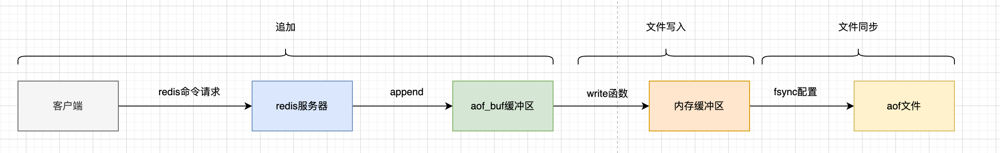

# Redis-持久化

redis持久化有三种：

- RDB快照
- AOF追加文件
- RDB+AOF混合模式

## 数据存储

持久化存储的数据位置可以通过dir参数来设置，

```bash
dir /data
```

## RDB持久化

RDB是指某一个时间dump当前内存存储的数据落到磁盘保存下来，后续恢复数据可以以某一个时间为基准的所有数据。可以在redis配置当中添加

```bash
save 900 1 #在900秒之后，如果有一个key发生变化，执行bgsave命令创建快照
save 300 10 #在300秒之后，如果有10个key发生变化，执行bgsave命令创建快照
save 60 10000 #在60秒之后，如果有1000个key发生变化，执行bgsave命令创建快照
```

### 创建快照方式

- save命令：同步执行，会阻塞主线程，影响其他客户端发起的请求，会对线上环境造成影响
- bgsave命令：异步执行，执行bgsave命令之后，redis客户端会立即返回，redis会fork一个新的线程，原来的redis主线程会继续处理来自客户端的请求，子线程异步执行备份

```bash
127.0.0.1:6379>
127.0.0.1:6379> bgsave
Background saving started
```

## AOF持久化

AOF全称叫append only file，相比RDB，AOF 的持久化的时效性比较好
持久化文件位置和RDB一样是根据dir参数来设置，可以在配置文件当中增加以下配置来启用 AOF 持久化：

```bash
appendonly yes
```

### 工作流程

- 命令追加append：客户端的写操作都会追加到aof_buf缓冲区当中
- 文件写入：系统调用了write函数将aof_buf缓冲区数据写入到内存缓冲区里面
- 文件同步fsync：根据配置的fsync选项同步aof_buf缓冲区数据到磁盘文件，这一步系统调用fsync函数，



### 持久化方式

- `appendonlyaof always`：每执行一个写命令，都会将缓冲区的数据写入到aof文件并且同步到磁盘也就是aof文件，也就是上图的write+fsync
- `appendonlyaof everysec`：每执行一个写命令，都会将缓冲区的数据写入到aof文件，后台线程每隔一秒执行fsync函数同步到aof文件，也就是上图的wirte+定时fsync
- `appendonlyaof no`：每执行一个写命令，都会将缓冲区的数据写入到aof文件，什么时候执行fsync函数具体是由操作系统决定，
- 区别：
  - 三种持久化方式的不同具体在于fsync函数的执行时机，是立刻执行还是定时执行还是由操作系统说了算

### 数据还原

- 服务器会创建一个无连接的redis客户端，加载aof文件，按照aof文件当中记录的写命令逐个执行

### AOF重写

- 按照上述aof的工作流程，每执行一个写命令，执行fsync函数同步数据到aof文件，随着时间的积累，程序运行时间变长，aof文件肯定会变得越来越大，肯定会影响现有的redis服务，redis提供了aof重写功能来解决aof文件过大的问题
- 通过创建一个新的小的aof文件来替代老的大的文件来解决文件体积膨胀，这就是aof重写

AOF重写触发方式：

- `auto-aof-rewrite-percentage`：当前 AOF 文件大小超过上次重写后 AOF 文件大小的百分比时，触发 AOF 重写机制，默认值为 100
- `auto-aof-rewrite-min-size`：当前 AOF 文件大小超过指定值时，才可能触发 AOF 重写机制，默认值为 64 MB

AOF重写工作流程：

从redis主进程当中fork 一个子进程来执行aof重写，不影响客户端请求， aof重写子进程会基于当前的内存数据来生成一个新的临时文件，这样的话，文件不用存储key内容的中间过程命令，比如key的增删改，直接获取key的一个最终状态，这样就就解决了aof文件体积过大的问题。这样还会遇到一个问题，在aof重写子进程的过程当中，主进程还会处理客户端的请求，发生新的数据变动这时又要怎么处理呢？redis提供了一个重写缓冲区的概念，在fork 子进程之后，客户端处理请求，在往aof_buf缓冲区写入的同时，往重写缓冲区也写入，完成重写之后，会将重写缓冲区的内容追加到临时文件，来和现有的数据库状态保持一致。最后，服务器用临时文件来替换旧的aof文件完成aof文件重写。

## 如何选择

- 推荐使用rdb+aof的混合持久化，结合rbd+aof的优点来最大限度的保证数据的可靠性
- Redis 4.0 开始支持了 aof+rdb的混合持久化，到aof 7.0 是默认支持的，

```bash
# pwd
/data
#
# ls -lah
total 2.7M
drwxr-xr-x 4 root root 4.0K Apr 10 06:06 .
drwxr-xr-x 1 root root   36 Mar 20 13:17 ..
drwxr-xr-x 2 root root 4.0K Apr 10 04:18 appendonlydir
-rw-r--r-- 1 root root 2.6M Apr 10 06:06 dump.rdb
drwx------ 2 root root  16K Sep  4  2023 lost+found
# cd appendonlydir
# ls -lah
total 50M
drwxr-xr-x 2 root root 4.0K Apr 10 04:18 .
drwxr-xr-x 4 root root 4.0K Apr 10 06:06 ..
-rw-r--r-- 1 root root 2.3M Apr 10 04:18 appendonly.aof.3075.base.rdb
-rw-r--r-- 1 root root  47M Apr 10 06:10 appendonly.aof.3075.incr.aof
-rw-r--r-- 1 root root  100 Apr 10 04:18 appendonly.aof.manifest
```

## 参考

- Redis设计与实现
