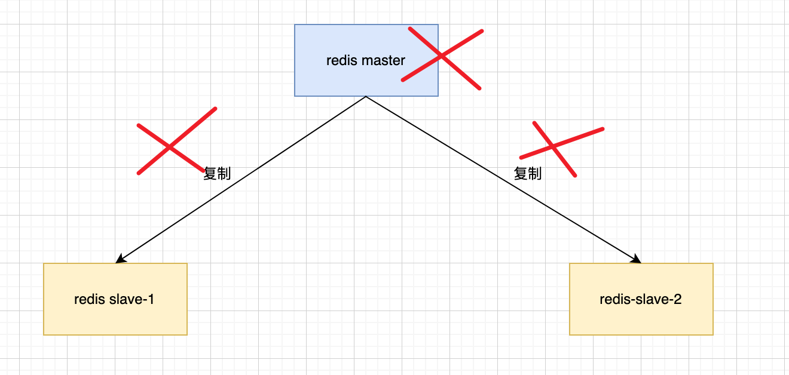
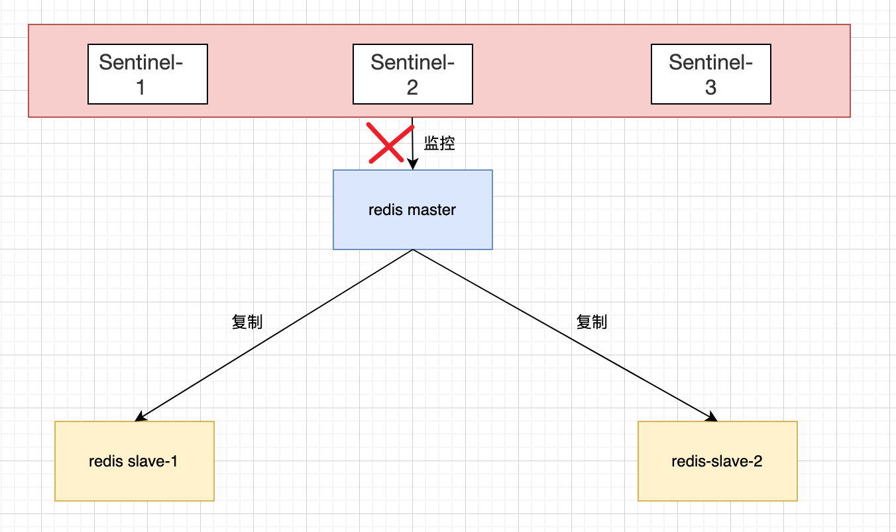
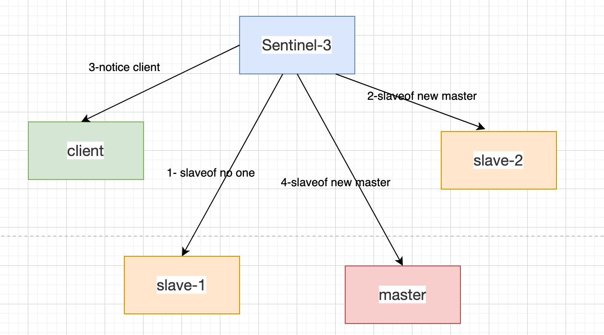
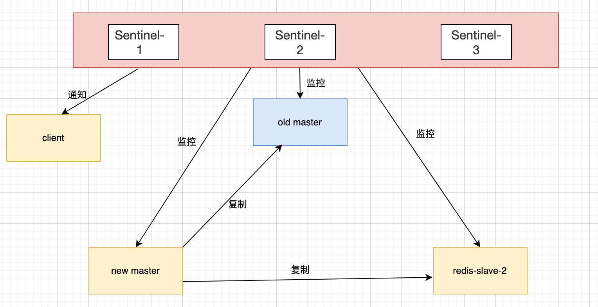

# Redis-Sentinel集群高可用

- Redis Sentinel 是 Redis 的高可用方案

## 主从复制

作用

- 将主节点的数据同步给从节点，作为主节点的一个备份，一旦主节点出现故障，从节点作为后备可以顶上去，并且保证数据尽量不丢失，主从复制是最终一致性
- 从节点可以扩展主节点的读能力，一旦主节点不能承受大并发量的读操作，从节点可以分担压力

问题

- 一旦主节点发生故障，需要手动晋升从节点为主节点。需要修改调用方的主节点地址。还需要命令其他从节点去复制新的主节点

## Sentinel 解决的问题

- 判断节点不可达的机制是否健全和标准
- 如果有多个从节点，怎样保证只有一个被晋升为主节点
- 通知客户端新的主节点机制是否足够健壮性

## Sentinel 作用

- 监控：Sentinel 节点会定期检测 redis 数据节点、其余 Sentinel 节点是否可达
- 通知：Sentinel 节点会将故障转移的结果通知给应用方
- 主节点故障转移：实现从节点晋升为主节点并维护后续正确的主从关系
- 配置提供者：在 Redis Sentinel 结构中，客户端在初始化的时候，连接的是 Sentinel 节点集合，从中获取主节点信息
- 因为 Redis Sentinel 包含了若干个 Sentinel 节点，这样也带来了好处：
  - 对于节点的故障判断是由多个 Sentinel 节点共同完成，这样可以有效防止误判
  - Sentinel 节点集合是由若干个 Sentinel 节点共同完成，这样即使个别 Sentinel 节点不可用，整个 Sentinel 节点集合依然是健壮的

区别：

- Sentinel 节点本身就是独立的 Redis 节点，不存储数据，只支持部分命令，

## 故障转移过程

- 主节点出现故障，此时两个从节点与主节点失去连接，主从复制失败

- 每个 Sentinel 节点通过定期监控发现主节点出现了故障

- 多个 Sentinel 节点对主节点的故障达成一致，选举出 Sentinel-3 节点作为领导者负责故障转移

- Sentinel 领导者节点执行了故障转移，自动化完成

- 故障转移之后整个 Redis Sentinel 的拓扑结构如图

## 监控

Sentinel 通过三个定时监控任务实现对各个节点的发现和监控

- 每隔十秒，每个 Sentinel 节点会向主节点和从节点发送 info 命令查看当前 redis 的拓扑结构
- 每隔两秒，每个 Sentinel 节点会向 redis 的数据节点的 `_sentinel__: hello `了解其他的 Sentinel 节点信息，如果是新加入的 Sentinel 节点，将该 Sentinel 节点信息保存起来，并与该 Sentinel 节点建立连接
  - Sentinel 节点之间交换主节点的状态，作为后面客观下线以及领导者选举的依据
- 每隔一秒，每个 Sentinel 节点会向主节点、从节点、其余 Sentinel 节点发送一条 ping 命令做一次心跳检测，来确认这些节点当前是否可达

## 下线

主观下线

- 每个 Sentinel 节点会每隔一秒对主节点、从节点、其他 Sentinel 节点发送 ping 命令做心跳检测，当这些节点超过 down-after-milliseconds 没有进行有效回复，Sentinel 节点就会对该节点做失败判定，这个行为就叫做主观下线

客观下线

-  当 Sentinel 主观下线的节点是主节点时，该 Sentinel 节点会通过 Sentinel is-master-down-addr 命令向其他 Sentinel 节点询问对主节点的判断，当超过个数，Sentinel 节点认为主节点确实有问题，这时该 Sentinel 节点会做出客观下线的决定。大部分 Sentinel 节点都对主节点的下线做了同意的决定，那么这个判定就是客观的

## 领导者 Sentinel 节点选举

- 采用 raft 算法实现领导者选举，

## 故障转移

Sentinel 节点负责故障转移，具体的转移步骤如下：

- 在从节点列表当中选择一个节点作为新的主节点，选择方法：
  - 过滤：不健康（主观下线、断线）、5秒内没有回复过 Sentinel 节点 ping 响应、与主节点失恋超过 down-after-millseconds * 10 秒
  - 选择 slave-prioity （从节点优先级）最高的从节点列表，如果存在则返回，不存在继续
  - 选择复制偏移量最大的从节点（复制的完整性），如果存在则返回，不存在继续
  - 选择 runnid 最小的从节点
- Sentinel 领导者节点回对第一步选出来的从节点执行 slaveof no one 命令让其成为主节点
- Sentinel 领导者节点会向剩余的从节点发送命令，让他们成为新主节点的从节点，复制规则和 parallel-syncs 参数有关
- Sentinel 节点集合会将原来的主节点更新为从节点，并保持着对其关注，当其回复后命令它去复制新的主节点

