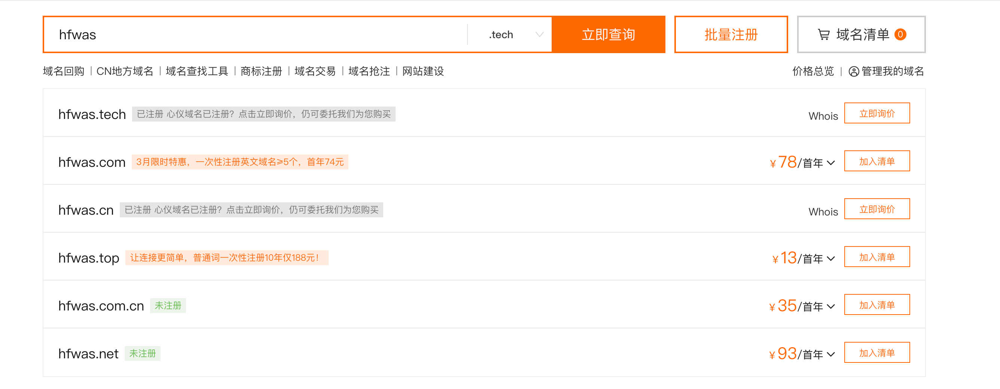
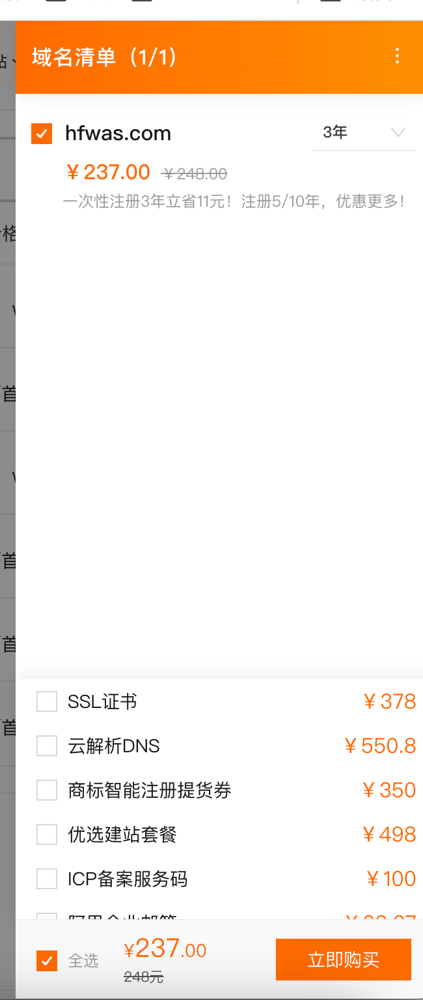
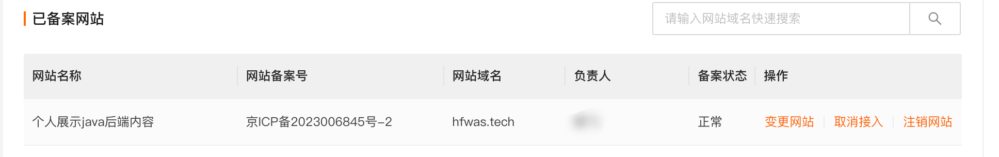
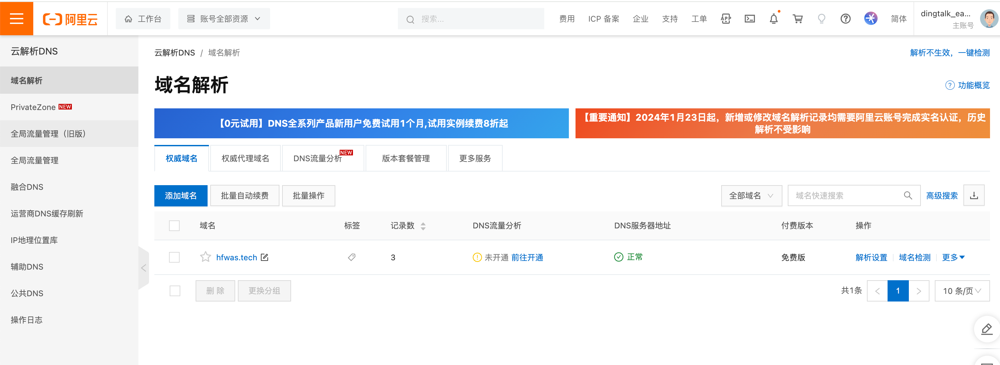
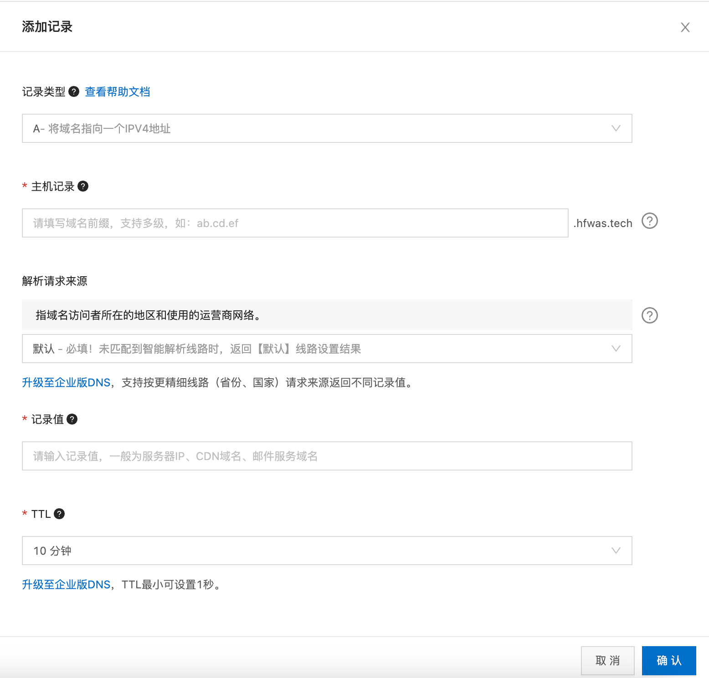
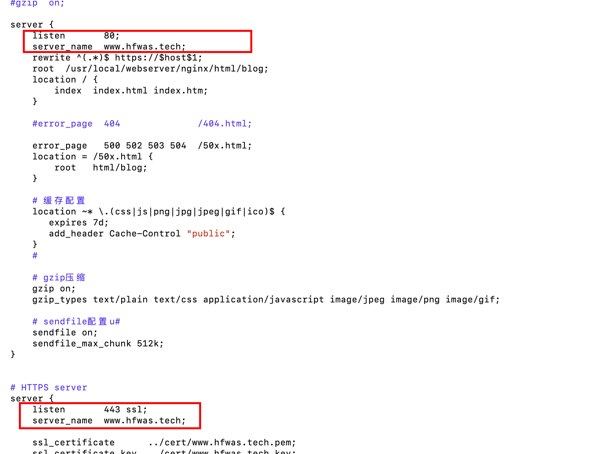
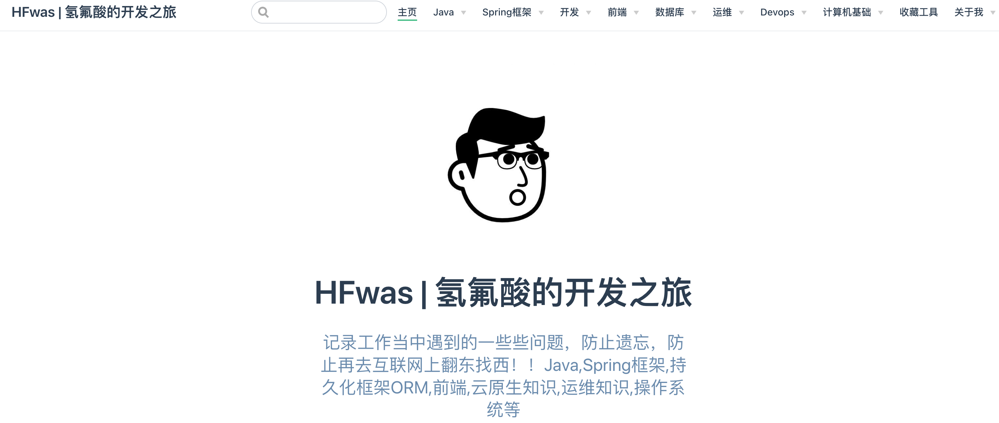

---
category:
  - blog
tag:
  - 域名
  - 博客
star: true
---
#  博客-域名申请

## 域名购买

- 访问阿里云域名产品，地址：`https://dc.console.aliyun.com/next/index?spm=5176.8351553.products-recent.ddomain.4ef81991mqNaQQ#/overview`
- 搜索自己想买的域名地址，查看是否已经有人购买，例如：`hfwas.tech`

- 如果没有注册，点击购买即可。

## 备案服务

- 访问阿里云备案服务，地址：`https://bsn.console.aliyun.com/#/bsnApply/ecs`
- 开始ICP备案服务，
- 需要填写域名和个人的相关信息，填写完毕之后，等待备案完成
- 需要登录公安域名
- 最后会拿到一个网站备案号，类似以下这种：

- 将备案号悬浮在网站最底部，能够跳转到`https://beian.miit.gov.cn/#/Integrated/index`

- 最

## DNS解析

- 阿里云dns解析，访问`https://dns.console.aliyun.com/?spm=5176.5176.console-base.ddns.594e750auYr0Zo#/dns/domainList`

- 点击域名解析-点击添加域名，将自己购买的域名补充好，进入域名
- 添加阿里云的服务器地址，自己网站部署的服务器地址，域名会解析到这个服务器。

## nginx修改

- 修改服务器当中的nginx配置，service name修改为域名名称，

- 执行命令，`./sbin/nginx -s reload`,重载nginx配置文件
- 浏览器输入hfwas.tech即可访问

