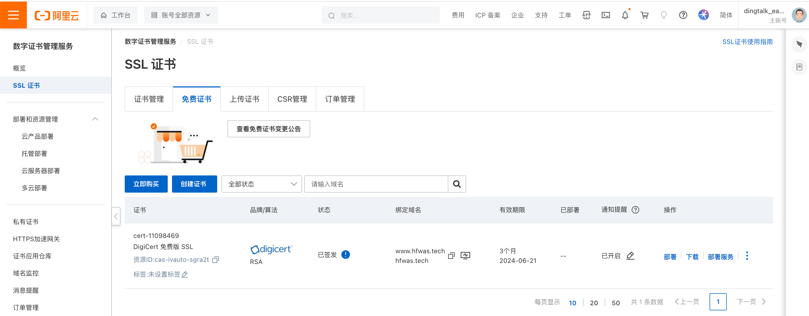
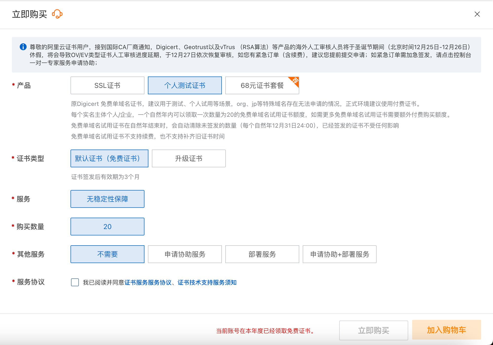
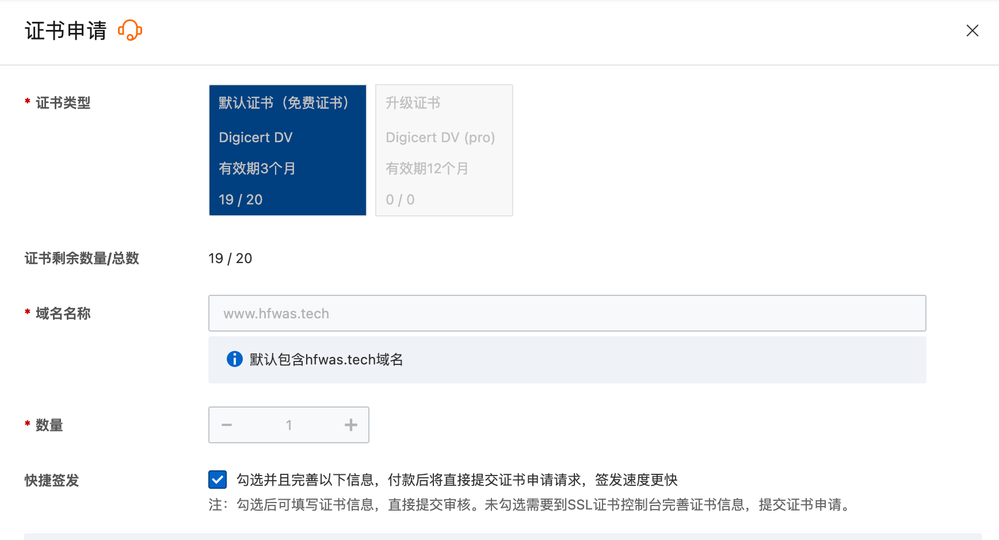
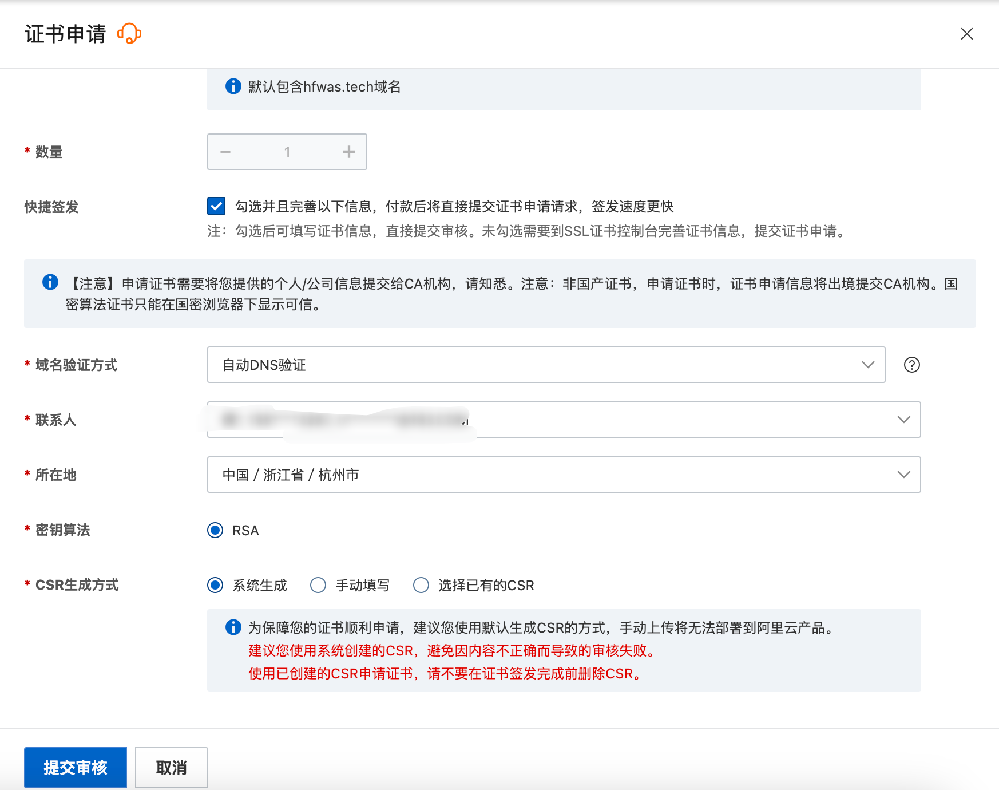
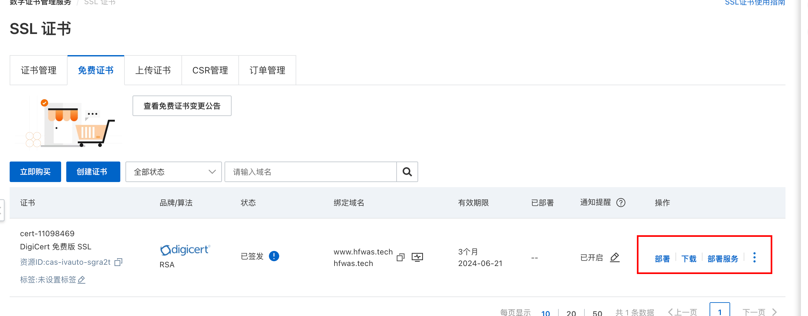
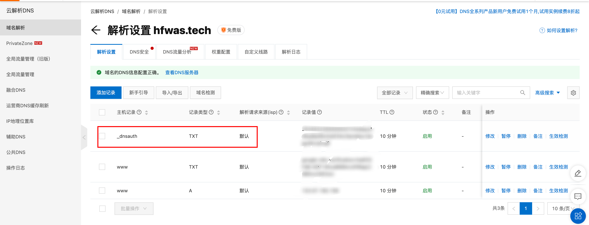
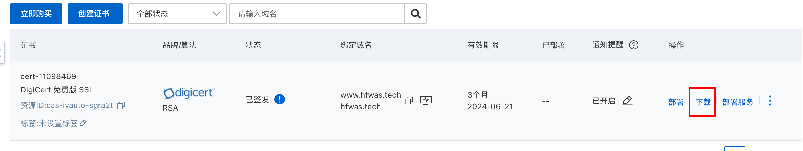
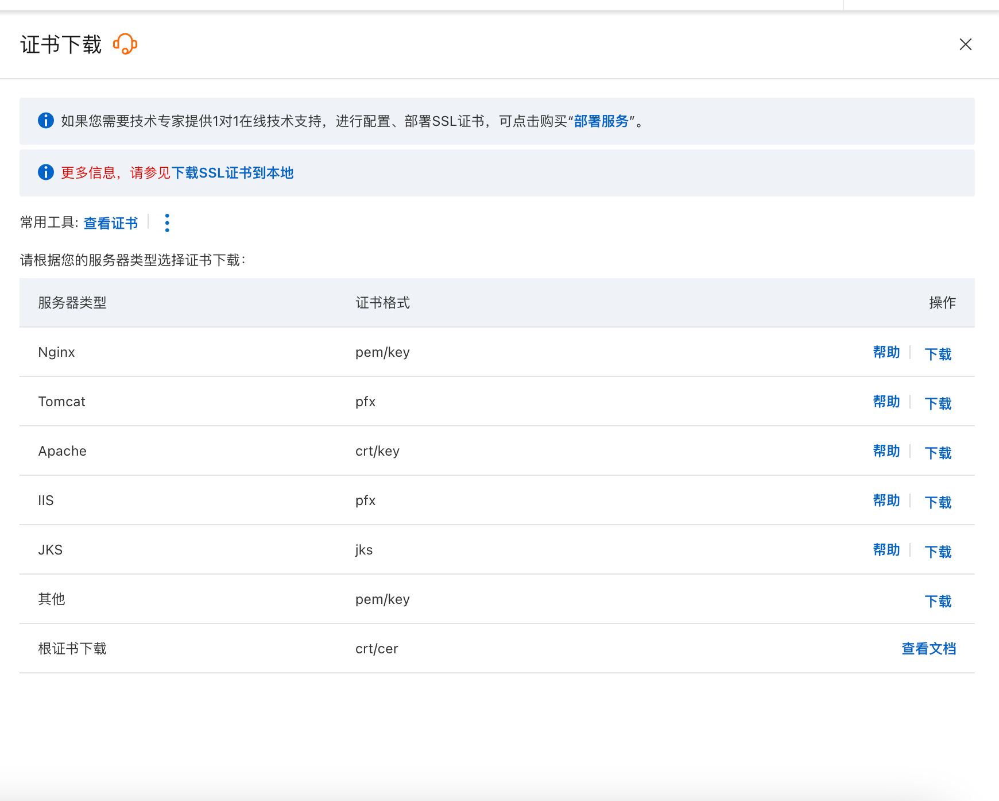

#  博客-开启https

## 创建证书

- 访问阿里云数字证书管理服务，地址：`https://yundun.console.aliyun.com/?spm=a2c1d.8251892.products-recent.dcas.11b35b76rbhoR7&p=cas#/certExtend/free/cn-hangzhou`

- 点击ssl证书，点击立即购买证书，选择个人测试证书，申请免费证书即可。这个是免费的

- 创建证书,选择我们申请的免费证书即可。填写自己的域名名称

- 需要录入网站的联系人，然后构建快捷签发之后会自动出现以下内容，点击提交审核即可

- 

## 域名校验

- 证书创建完成之后，点击列表页会有一个域名验证的按钮，点击域名验证。

- 弹窗框会有一个提示，添加域名的dns解析，复制内容
- 进入云解析dns，添加一条记录，主机记录类似`_dnsauth`这条

- 然后点击验证，验证通过之后，很快证书就会签发，列表项就会变成这样

- 点击下载，选择对应的类型，我们选择nginx即可

- 文件解压出来有两个文件，分别是pem和ke y
- 将文件上传到服务器nginx目录下，新建cert目录
- 修改nginx.conf配置，添加两个配置，
- 同时开启443的配置，
- 80端口添加重定向到443，
- 重启nginx即可，
- 访问网站，会发现已经变成了https
