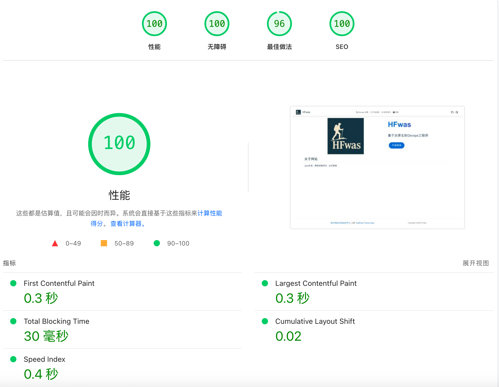

# 博客-pagespeed优化

- 最近将博客在cloudflare 也部署了一份，域名：[https://hfwas-blog.pages.dev](https://hfwas-blog.pages.dev)
- 在[https://pagespeed.web.dev](https://pagespeed.web.dev)当中看了一下目前博客的评分还达不到100分，根据网站的提示做了图片的优化

## 优化图片大小

- 使用[https://squoosh.app/editor](https://squoosh.app/editor)网站来优化图片大小，将原来较大的图片格式转换为 WebP 和 AVIF 等图片格式来减少图片大小提升加载速度

