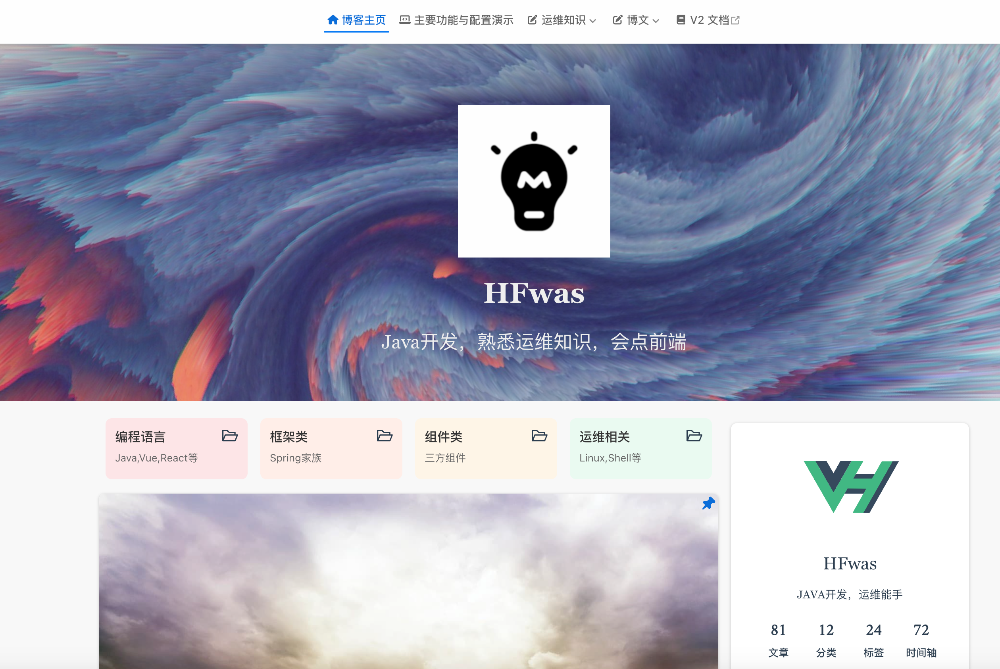
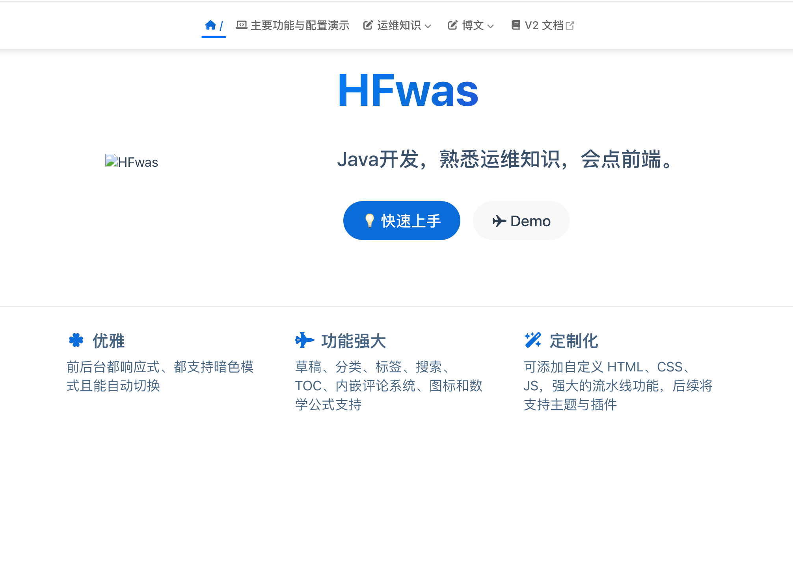

---
category:
  - vuepress-theme-hope
tag:
  - vuepress-theme-hope
star: true
---

# 博客-主页展示效果
- 前置知识：
  - 使用主题vuepress-theme-hope

## 博客主页

- 自定义生成的demo下的src目录下的README决定了博客主页的效果图
- 具体参考以下内容：测试

```
---
home: true
layout: BlogHome
icon: home
title: 博客主页
heroImage: /assets/icon/guide-maskable.png
heroText: HFwas
heroFullScreen: false
tagline: Java开发，熟悉运维知识，会点前端
projects:
  - icon: project
    name: 编程语言
    desc: Java,Vue,React等
    link: https://你的项目链接

  - icon: project
    name: 框架类
    desc: Spring家族
    link: https://链接地址

  - icon: project
    name: 组件类
    desc: 三方组件
    link: https://你的书籍链接

  - icon: project
    name: 运维相关
    desc: Linux,Shell等
    link: https://你的文章链接

---
```

- 效果图类似以下这种：



## 知识库类型

- 参考以下

```
---
home: true
icon: home
index: false
heroText: HFwas
heroImage: /merge.png
tagline: Java开发，熟悉运维知识，会点前端。
actions:
  - text: 💡 快速上手
    link: /guide/get-started.html
    type: primary

  - text: ✈️ Demo
    link: https://blog-demo.mereith.com
    type: secondary

features:
  - title: 优雅
    icon: clover
    details: 前后台都响应式、都支持暗色模式且能自动切换

  - title: 功能强大
    icon: jet-fighter
    details: 草稿、分类、标签、搜索、TOC、内嵌评论系统、图标和数学公式支持

  - title: 定制化
    icon: wand-magic-sparkles
    details: 可添加自定义 HTML、CSS、JS，强大的流水线功能，后续将支持主题与插件

---
```

- 效果图类似：

