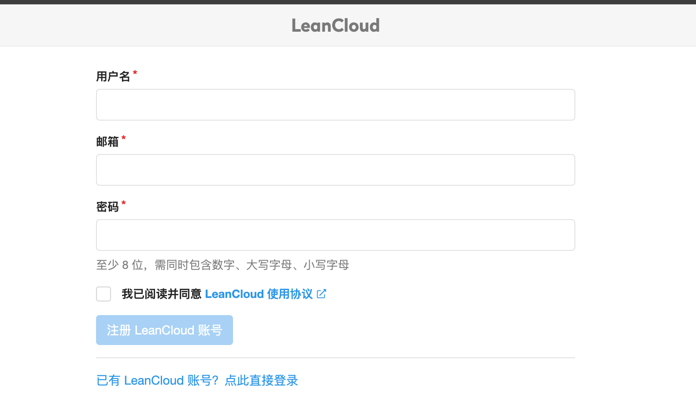
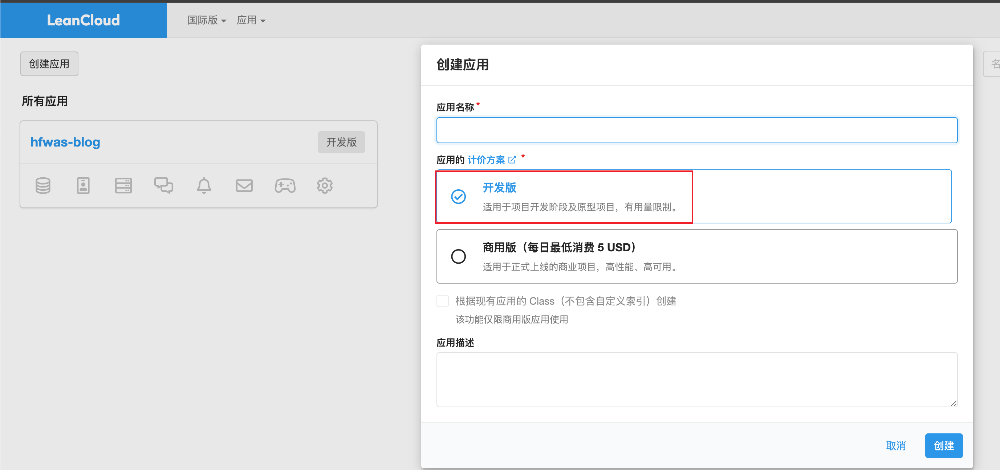
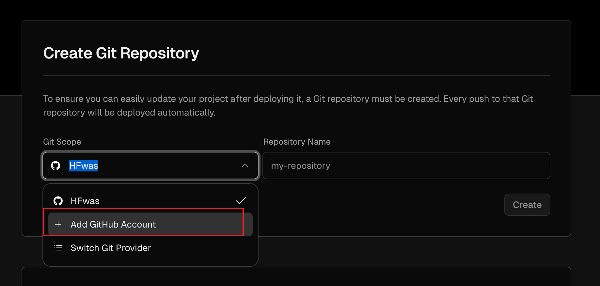
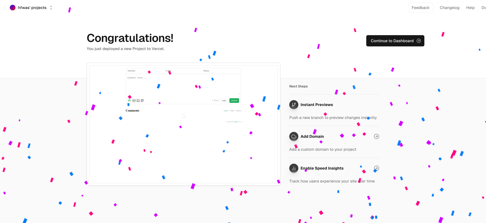
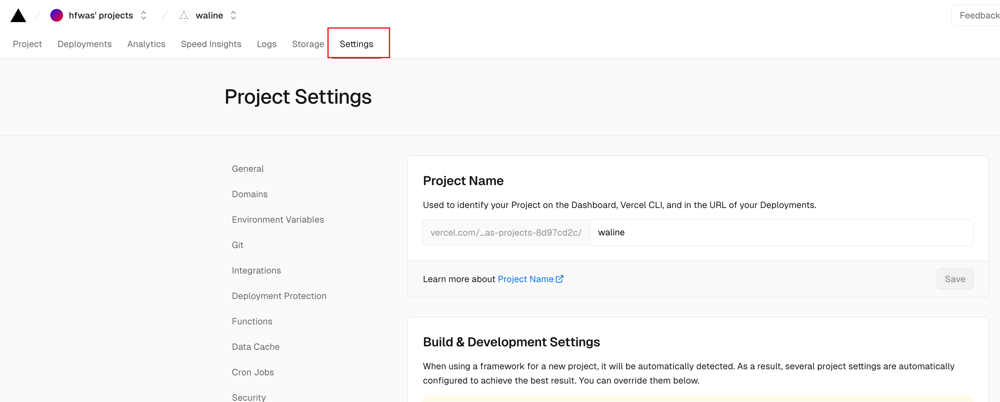
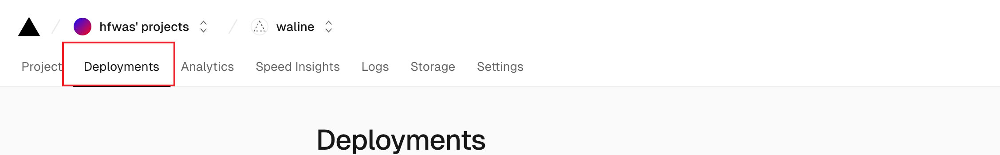
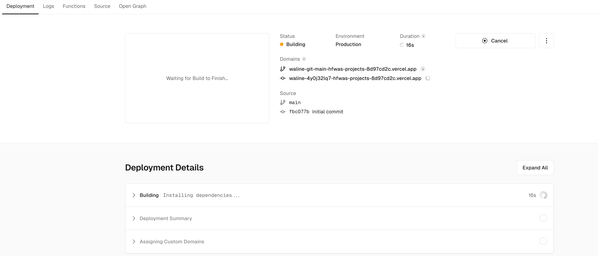
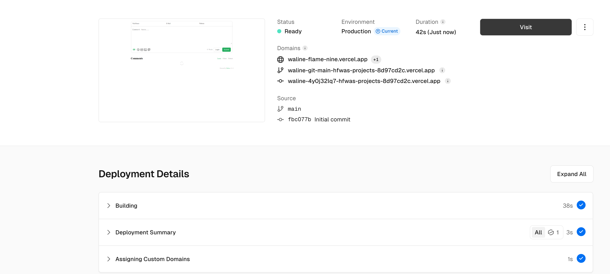

---
category:
  - blog
tag:
  - blog
  - waline
star: true
---

# 博客-接入waline

## 接入过程

- 参考waline的中文文档快速上手，按照文档就可以正常接入
- 这里我吧自己接入waline的过程写成文档记录一下
- 首先访问waline快速接入文档：https://waline.js.org/guide/get-started/
- 访问国际版[leancloud](https://console.leancloud.app/register)，注册账号。

- 选择创建应用

- 进入应用，左侧设置菜单，应用凭证可以看到应用 的三个凭证信息，后续会用到
- 访问[vercel](https://vercel.com/new/clone?repository-url=https%3A%2F%2Fgithub.com%2Fwalinejs%2Fwaline%2Ftree%2Fmain%2Fexample)，一定要访问这个地址，不要直接搜索vercel进入，
- 选择添加github账号，填写对应仓库。随便输入一个仓库名称即可，点击开始创建

- vercel会自动连接github创建代码仓库，用作网站部署使用，等待部署完成，如果出现类似下图这种说明部署成功。点击进入面板操作

- 点击setting设置按钮，选择环境变量菜单，添加三个环境变量参数，分别是：LEAN_ID，LEAN_KEY，LEAN_MASTER_KEY。分别对应leancloud当中的三个参数

- 环境变量设置完成之后，点击deployment菜单，点击重启部署，等待部署完成

- 部署完成之后，会出现类似下述的效果，点击访问就可以看到waline的效果了

- 在点击visit之后的地址后缀加上`/ui/register`之后，进入waline的管理端，首次进入需要注册账号，默认是管理员。
  - 建议开启二因子认证，防止账号被盗
- 

## 注意点

- 第一次部署完成之后，点击访问，出现的地址是不能直接使用的，配置在前端之后，访问报错跨域问题，过个几分钟，再次点击会出现另外一个地址，这时候这个地址是可以在前端项目当中使用的
