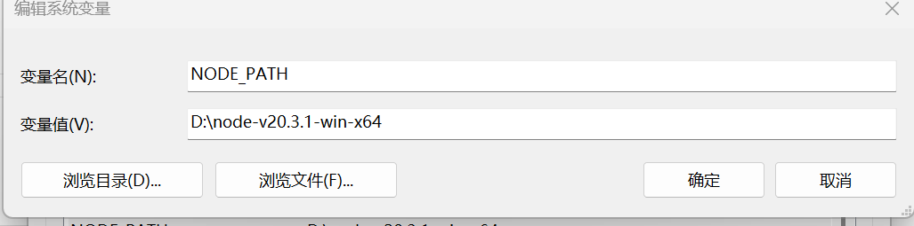
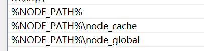

# windows电脑软件初始化

## 开发软件

- Toolbox（通过Toolbox安装idea,webstorm,datagrip等）

- [vscode](https://code.visualstudio.com/download)

- [git](https://git-scm.com/downloads)

- [maven](https://maven.apache.org/download.cgi)

- [redis](https://github.com/qishibo/AnotherRedisDesktopManager/releases)

- [nodejs](https://dev.nodejs.cn/download/current/)

  - 安装位置：`D:\node-v20.3.1-win-x64`

  - 在文件夹下新建以下两个文件夹：

    - node_cache

    - node_global

  - 配置环境变量：

  

  - PATH变量新增：

  

  - 执行命令

  ```bash
  npm config set prefix "D:\node-v20.3.1-win-x64\node_cache"
  npm config set cache "D:\node-v20.3.1-win-x64\node_global"
  
  # 设置代理
  npm config set proxy http://IP:PORT
  
  # 查看配置列表是否配置成功
  npm config list
  ```

  - 查看是否安装成功：

  ```bash
  node -v 
  
  npm -v 
  ```

- 

## 压缩软件

- [bandzip](https://www.bandisoft.com/bandizip/)

## 视频软件

- [potplayer](https://potplayer.daum.net/)

## 截图软件

- [snipaste](https://zh.snipaste.com/)

## 文件检索软件

- [Everything](https://www.voidtools.com/zh-cn/downloads/)

## 终端管理工具

- [xshell](https://www.xshell.com/zh/free-for-home-school/)
- [xftp](https://www.xshell.com/zh/free-for-home-school/)

