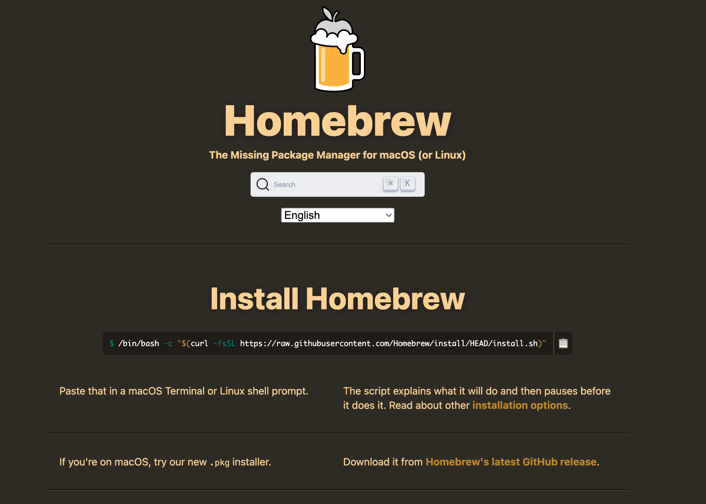
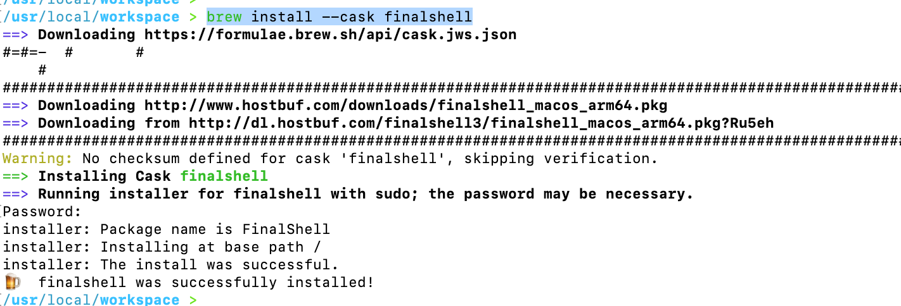
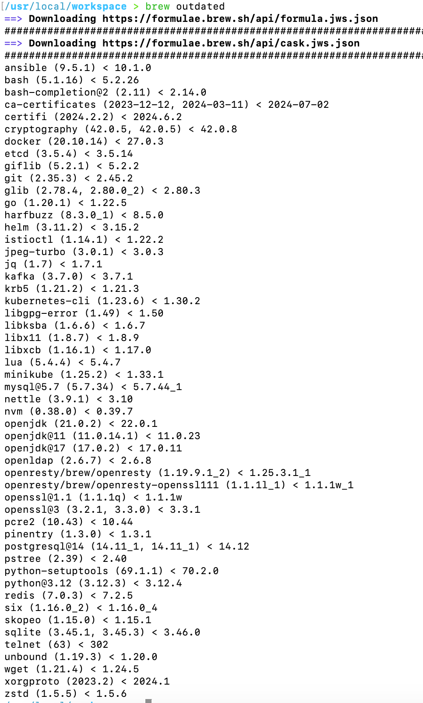

# 软件安装 - mac安装homebrew

## 安装

- 首先电脑一定要先安装clashx或者其他同类产品，要配置有对应网络环境
- 执行`/bin/bash -c "$(curl -fsSL https://raw.githubusercontent.com/Homebrew/install/HEAD/install.sh)"`

## 命令

- 安装软件，`brew install 软件名称`，例如：`brew install --cask finalshell`, 参数`--cask`意思是安装桌面版

- 查看所有过期版本服务列表，执行`brew outdated`

- 更新指定服务版本`brew update 软件名称`
- 卸载服务`brew uninstall 软件名称`