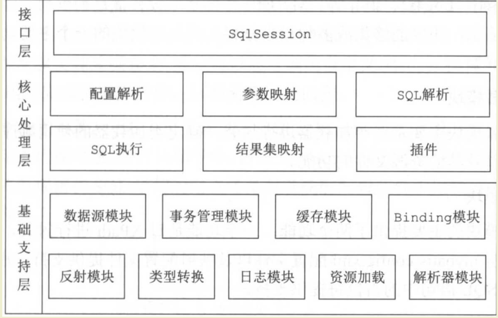

# mybatis概述

- [Mybatis](https://github.com/HFwas/mybatis-3.git)地址fork官方仓库很久之前，但是一直断断续续阅读源码，这次希望重新拾起来

## 架构图

- mybatis主要分为三大块，接口层，数据处理层，基础支撑层

### 核心处理层

#### 配置解析

#### 参数映射

#### sql解析

#### sql执行

#### 结果集映射

#### 插件

### 基础支撑层

#### 数据源模块

#### 事务管理

#### 缓存管理

#### bing模块

#### 反射模块

#### 类型转换

#### 日志模块

#### 资源加载

#### 解析器模块

