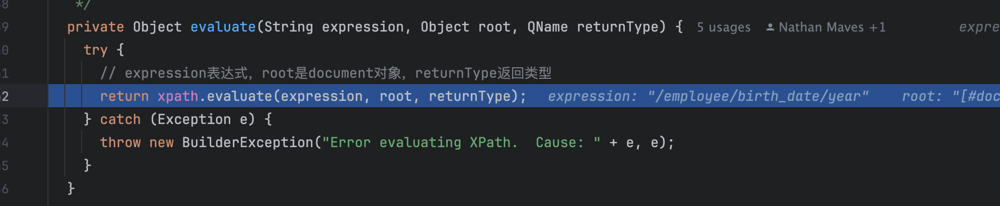
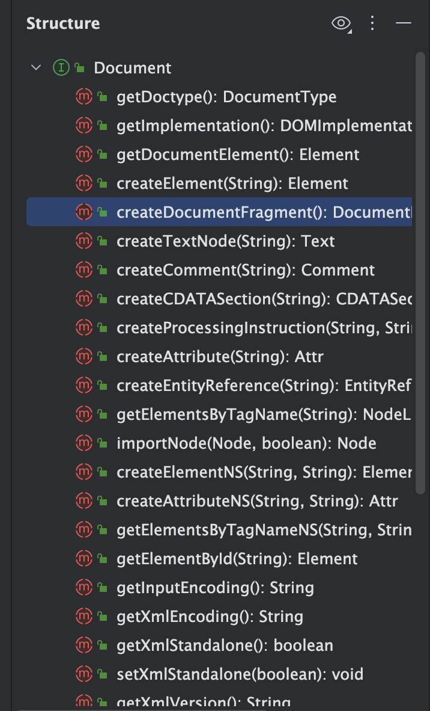

# Mybatis-解析模块

- 主要负责解析mybatis当中的myabtis-config.xml文件，封装了java底层提供的xpath模块，提供了自己的解析方法
- 处理配置文件当中的动态sql提供支持
- 后续parsing 模块下的所有类其实都是围绕着上述两个功能展开的

## 模块详情

- 大概结构如下图：


- 可以看到parsing包下边只有几个类，代码大约只有947行


- 单元测试类
  - 类`org.apache.ibatis.parsing.XPathParserTest`主要内容分为两块：
    - `XPathParser`的构造方法，通过xml文件不同方法获取`XPathParser`对象
    - eval解析xml对象，获取对应的节点内容和节点
  - 类`org.apache.ibatis.parsing.PropertyParserTest`主要内容分为：解析配置文件当中动态的sql占位符，将`${}`占位符替换为字符串
  - 类`org.apache.ibatis.parsing.GenericTokenParserTest`主要内容为：解析

## 类XPathParser

- 主要封装了xpath 提供的方法,实现mybatis的配置文件提供解析对应的节点的值
- 属性字段有以下：

```java
  // 解析xml文件生成的document对象
  private final Document document;
  // 是否校验xml,一般情况下，值为true，
  private boolean validation;
  // xml实体解析器， 一般是根据xml头部的xsd,dtd链接文件
  private EntityResolver entityResolver;
  // 变量 Properties 对象，用来替换需要动态配置的属性值
  private Properties variables;
  // Java XPath 对象，用于查询xml当中的节点和元素
  private XPath xpath;
```

- Document对象
  - 主要是解析xml文件获得，使用xpath工具
  - 可以看到主要是执行XPathParser构造方法的时候，通过createDocument得到的document对象填充到xpathpraser当中的document当中
  - 具体类位置：org.apache.ibatis.parsing.XPathParser#createDocument，
  - 通过documentbuilder解析new inputsource(input stream inputstream)得到的document对象，这里就是基于xpath来解析xml文件当中的节点
- Properties对象是配置文件当中定义的属性的集合，类似下属内容：


- entityResolver指的是xml头部当中的xsd和dtd文件，描述对当前xml文件的约束，但是通常情况下这个地址都是互联网地址，有时需要从本地文件系统当中加载xsd和dtd文件，可以看下`org.apache.ibatis.builder.xml.XMLMapperEntityResolver`当中定义了从具体位置加载对应的xsd和dtd文件，
- Properties对象
  - xml文件当中用户定义的`property`键值对，

## eval方法

-  XPathParser提供了很多eval方法，分别解析对应的数据类型的，包括evallong,evalinteger,evalstring之类
- 实际上方法内部都是调用的xpath提供的evaluate方法，



- 解析对应的节点内容，将内容转换为对应的数据类型

## 疑问点

### xpath和document有啥不一致？

- xpath 是Java内置库当中提供的一种解析xml文件的实体类，可以解析xml获取对应的节点或者对应路径的值。重点是对文档的解析
- document对象是解析xml文件的文档对象，提供了对与文档的操作，重点是对文档的操作


