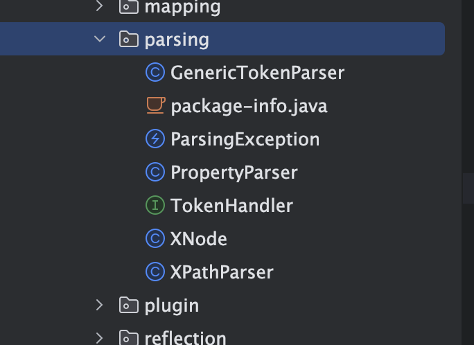
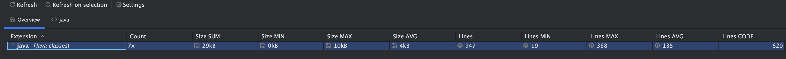

# 解析模块

- 主要负责解析mybatis当中的myabtis-config.xml文件，封装了java底层提供的xpath模块，提供了自己的解析方法
- 处理配置文件当中的动态sql提供支持
- 后续parsing 模块下的所有类其实都是围绕着上述两个功能展开的

## 模块详情

- 大概结构如下图：



- 可以看到parsing包下边只有几个类，代码大约只有947行



- 单元测试类
  - 类`org.apache.ibatis.parsing.XPathParserTest`主要内容分为两块：
    - `XPathParser`的构造方法，通过xml文件不同方法获取`XPathParser`对象
    - eval解析xml对象，获取对应的节点内容和节点
  - 类`org.apache.ibatis.parsing.PropertyParserTest`主要内容分为
  - 类`org.apache.ibatis.parsing.GenericTokenParserTest`主要内容为：
- 

## 类XPathParser

- 主要封装了xpath 提供的方法,实现对mybati的配置文件提供解析对应的节点的值
- 属性字段有以下：

```java
  // 解析xml文件生成的document对象
  private final Document document;
  // 是否校验xml,一般情况下，值为true，
  private boolean validation;
  // xml实体解析器， 一般是根据xml头部的xsd,dtd链接文件
  private EntityResolver entityResolver;
  // 变量 Properties 对象，用来替换需要动态配置的属性值
  private Properties variables;
  // Java XPath 对象，用于查询xml当中的节点和元素
  private XPath xpath;
```

- Document对象
  - 主要是解析xml文件获得，使用xpath工具
  - 可以看到主要是执行XPathParser构造方法的时候，通过createDocument得到的document对象填充到xpathpraser当中的document当中
  - 具体类位置：org.apache.ibatis.parsing.XPathParser#createDocument，
  - 通过documentbuilder解析new inputsource(input stream inputstream)得到的document对象，这里就是基于xpath来解析
- Properties对象是配置文件当中配置的属性的集合，


## 疑问点

### xpath和document有啥不一致？

