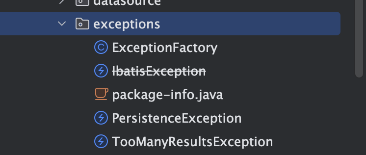

# Mybatis-异常模块

## 代码结构



- 主要定义了mybatis自己的异常类，PersistenceException是mybatis的基类，继承IbatisException，但是IbatisException已经被废弃

##  ExceptionFactory

- 将异常转换为mybatis自己的业务错误，

```
public class ExceptionFactory {

  private ExceptionFactory() {
    // Prevent Instantiation
  }

  // 转换异常为mybatis自己的业务报错，
  public static RuntimeException wrapException(String message, Exception e) {
    return new PersistenceException(ErrorContext.instance().message(message).cause(e).toString(), e);
  }

}
```

##  TooManyResultsException

- mybatis自己的特有错误类，返回太多结果异常。

```
public class TooManyResultsException extends PersistenceException {

  private static final long serialVersionUID = 8935197089745865786L;

  public TooManyResultsException() {
    super();
  }

  public TooManyResultsException(String message) {
    super(message);
  }

  public TooManyResultsException(String message, Throwable cause) {
    super(message, cause);
  }

  public TooManyResultsException(Throwable cause) {
    super(cause);
  }
}
```

## 其他异常

- Mybatis 包下边的异常类只有着几个，可以全局搜索PersistenceException可以看到其他包下边也有一些继承了PersistenceException的异常类，例如：
-  BindingException： org.apache.ibatis.binding.BindingException
-  BuilderException： org.apache.ibatis.builder.BuilderException
-  CacheException： org.apache.ibatis.cache.CacheException
-  DataSourceException： org.apache.ibatis.datasource.DataSourceException
-  ExecutorException： org.apache.ibatis.executor.ExecutorException
-  LogException： org.apache.ibatis.logging.LogException
-  ResultMapException： org.apache.ibatis.executor.result.ResultMapException
-  ParsingException： org.apache.ibatis.parsing.ParsingException
-  ScriptingException： org.apache.ibatis.scripting.ScriptingException
-  SqlSessionException： org.apache.ibatis.session.SqlSessionException
-   PluginException： org.apache.ibatis.plugin.PluginException
-  TypeException： org.apache.ibatis.type.TypeException
-  TransactionException： org.apache.ibatis.transaction.TransactionException