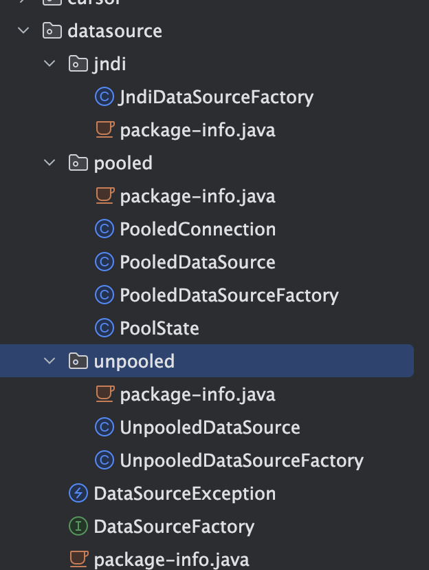
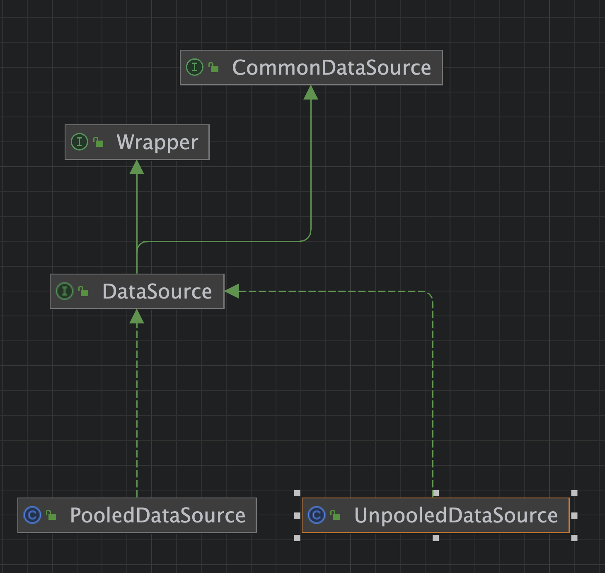

# Mybatis-数据源模块

- 

## 模块详情



## 类DataSourceFactory

```java
public interface DataSourceFactory {
  /**
   * 设置DataSource相关的属性
   * @param props
   */
  void setProperties(Properties props);

  /**
   * 获取 DataSource 相关的设置
   * @return
   */
  DataSource getDataSource();

}
```

### 非池化UnpooledDataSourceFactory

#### 构造方法

```java
public UnpooledDataSourceFactory() {
    this.dataSource = new UnpooledDataSource();
  }
```

#### 非池化数据源UnpooledDataSource

- 支持配置几个属性，分别是：
  - 用户名：username
  - 密码：password
  - 链接地址：url
  - 驱动：driver
- 

```java
public UnpooledDataSource() {
  }

  public UnpooledDataSource(String driver, String url, String username, String password) {
    this.driver = driver;
    this.url = url;
    this.username = username;
    this.password = password;
  }

  public UnpooledDataSource(String driver, String url, Properties driverProperties) {
    this.driver = driver;
    this.url = url;
    this.driverProperties = driverProperties;
  }

  public UnpooledDataSource(ClassLoader driverClassLoader, String driver, String url, String username, String password) {
    this.driverClassLoader = driverClassLoader;
    this.driver = driver;
    this.url = url;
    this.username = username;
    this.password = password;
  }
```

#### 方法setProperties

```java
@Override
  public void setProperties(Properties properties) {
    Properties driverProperties = new Properties();
    // 创建dataSource对应的MetaObject对象
    MetaObject metaDataSource = SystemMetaObject.forObject(dataSource);
    for (Object key : properties.keySet()) {
      String propertyName = (String) key;
      // 如果是 driver 驱动， 初始化到driverProperties当中
      if (propertyName.startsWith(DRIVER_PROPERTY_PREFIX)) {
        String value = properties.getProperty(propertyName);
        driverProperties.setProperty(propertyName.substring(DRIVER_PROPERTY_PREFIX_LENGTH), value);
      // 初始化到 MetaObject 当中
      } else if (metaDataSource.hasSetter(propertyName)) {
        String value = (String) properties.get(propertyName);
        Object convertedValue = convertValue(metaDataSource, propertyName, value);
        metaDataSource.setValue(propertyName, convertedValue);
      } else {
        throw new DataSourceException("Unknown DataSource property: " + propertyName);
      }
    }
    // 设置 driverProperties 到 MetaObject 当中
    if (driverProperties.size() > 0) {
      metaDataSource.setValue("driverProperties", driverProperties);
    }
  }
```

#### 转换方法convertValue

```java
private Object convertValue(MetaObject metaDataSource, String propertyName, String value) {
    Object convertedValue = value;
    // 获取属性名称对应的set方法类
    Class<?> targetType = metaDataSource.getSetterType(propertyName);
    // 转换对应的类型
    if (targetType == Integer.class || targetType == int.class) {
      convertedValue = Integer.valueOf(value);
    } else if (targetType == Long.class || targetType == long.class) {
      convertedValue = Long.valueOf(value);
    } else if (targetType == Boolean.class || targetType == boolean.class) {
      convertedValue = Boolean.valueOf(value);
    }
    return convertedValue;
  }
```


### 池化PooledDataSourceFactory

- 池化数据源工厂继承了非池化数据源工厂类UnpooledDataSourceFactory

#### 构造方法

```java
public PooledDataSourceFactory() {
    this.dataSource = new PooledDataSource();
  }
```

#### 自定义参数

```
// OPTIONAL CONFIGURATION FIELDS
  // 在任意时间可以存在的活动（也就是正在使用）连接数量
  protected int poolMaximumActiveConnections = 10;
  // 任意时间可能存在的空闲连接数。
  protected int poolMaximumIdleConnections = 5;
  // 在被强制返回之前，池中连接被检出（checked out）时间
  protected int poolMaximumCheckoutTime = 20000;
  // 这是一个底层设置，如果获取连接花费了相当长的时间，连接池会打印状态日志并重新尝试获取一个连接（避免在误配置的情况下一直安静的失败）
  protected int poolTimeToWait = 20000;
  // 这是一个关于坏连接容忍度的底层设置， 作用于每一个尝试从缓存池获取连接的线程. 如果这个线程获取到的是一个坏的连接，那么这个数据源允许这个线程尝试重新获取一个新的连接，
  // 但是这个重新尝试的次数不应该超过 poolMaximumIdleConnections 与 poolMaximumLocalBadConnectionTolerance 之和
  protected int poolMaximumLocalBadConnectionTolerance = 3;
  // 发送到数据库的侦测查询，用来检验连接是否正常工作并准备接受请求
  protected String poolPingQuery = "NO PING QUERY SET";
  // 是否启用侦测查询。若开启，需要设置 poolPingQuery 属性为一个可执行的 SQL 语句（最好是一个速度非常快的 SQL 语句），默认值：false。
  protected boolean poolPingEnabled;
  protected int poolPingConnectionsNotUsedFor;
```


## 类DataSource

- 可以看到PooledDataSource和UnpooledDataSource都实现了DataSource接口，



### 类UnpooledDataSource

#### 构造方法

- 设置几个主要的参数，包括：驱动名称，链接地址，用户名，密码，事务隔离级别等

```
private ClassLoader driverClassLoader;
  private Properties driverProperties;
  private static Map<String, Driver> registeredDrivers = new ConcurrentHashMap<>();

  /// 驱动名称
  private String driver;
  // 链接地址
  private String url;
  // 用户名
  private String username;
  // 密码
  private String password;

  // 是否自动提交sql
  private Boolean autoCommit;
  // 默认的事务隔离级别
  private Integer defaultTransactionIsolationLevel;
  // 网络链接超时时间设置
  private Integer defaultNetworkTimeout;

  static {
    Enumeration<Driver> drivers = DriverManager.getDrivers();
    while (drivers.hasMoreElements()) {
      Driver driver = drivers.nextElement();
      registeredDrivers.put(driver.getClass().getName(), driver);
    }
  }

  public UnpooledDataSource() {
  }

  public UnpooledDataSource(String driver, String url, String username, String password) {
    this.driver = driver;
    this.url = url;
    this.username = username;
    this.password = password;
  }

  public UnpooledDataSource(String driver, String url, Properties driverProperties) {
    this.driver = driver;
    this.url = url;
    this.driverProperties = driverProperties;
  }

  public UnpooledDataSource(ClassLoader driverClassLoader, String driver, String url, String username, String password) {
    this.driverClassLoader = driverClassLoader;
    this.driver = driver;
    this.url = url;
    this.username = username;
    this.password = password;
  }

  public UnpooledDataSource(ClassLoader driverClassLoader, String driver, String url, Properties driverProperties) {
    this.driverClassLoader = driverClassLoader;
    this.driver = driver;
    this.url = url;
    this.driverProperties = driverProperties;
  }
```

####  getConnection

-   getConnection主要是调用doGetConnection方法实现

```
@Override
  public Connection getConnection() throws SQLException {
    return doGetConnection(username, password);
  }

  @Override
  public Connection getConnection(String username, String password) throws SQLException {
    return doGetConnection(username, password);
  }
```

- doGetConnection方法获取链接

```
private Connection doGetConnection(String username, String password) throws SQLException {
    Properties props = new Properties();
    if (driverProperties != null) {
      props.putAll(driverProperties);
    }
    if (username != null) {
      props.setProperty("user", username);
    }
    if (password != null) {
      props.setProperty("password", password);
    }
    return doGetConnection(props);
  }

  private Connection doGetConnection(Properties properties) throws SQLException {
    // 初始化驱动
    initializeDriver();
    // 获取链接
    Connection connection = DriverManager.getConnection(url, properties);
    // 配置链接参数：比如：是否自动提交，事务隔离级别等
    configureConnection(connection);
    return connection;
  }
```

- 

####  initializeDriver

- 初始化驱动到registeredDrivers当中，当缓存当中没有的话，就执行下属逻辑

```
private synchronized void initializeDriver() throws SQLException {
    if (!registeredDrivers.containsKey(driver)) {
      // 获取驱动对应的实体类
      Class<?> driverType;
      try {
        if (driverClassLoader != null) {
          driverType = Class.forName(driver, true, driverClassLoader);
        } else {
          driverType = Resources.classForName(driver);
        }
        // DriverManager requires the driver to be loaded via the system ClassLoader.
        // http://www.kfu.com/~nsayer/Java/dyn-jdbc.html
        Driver driverInstance = (Driver) driverType.getDeclaredConstructor().newInstance();
        DriverManager.registerDriver(new DriverProxy(driverInstance));
        // 将本次获取的驱动加入到缓存当中
        registeredDrivers.put(driver, driverInstance);
      } catch (Exception e) {
        throw new SQLException("Error setting driver on UnpooledDataSource. Cause: " + e);
      }
    }
```

####  configureConnection

- 配置链接的参数，比如网络超时时间，是否自动提交，事务的隔离级别

```
private void configureConnection(Connection conn) throws SQLException {
    // 默认的网络超时时间
    if (defaultNetworkTimeout != null) {
      conn.setNetworkTimeout(Executors.newSingleThreadExecutor(), defaultNetworkTimeout);
    }
    // 设置是否自动提交
    if (autoCommit != null && autoCommit != conn.getAutoCommit()) {
      conn.setAutoCommit(autoCommit);
    }
    // 设置默认的事务隔离级别
    if (defaultTransactionIsolationLevel != null) {
      conn.setTransactionIsolation(defaultTransactionIsolationLevel);
    }
  }
```


### 类PooledDataSource
