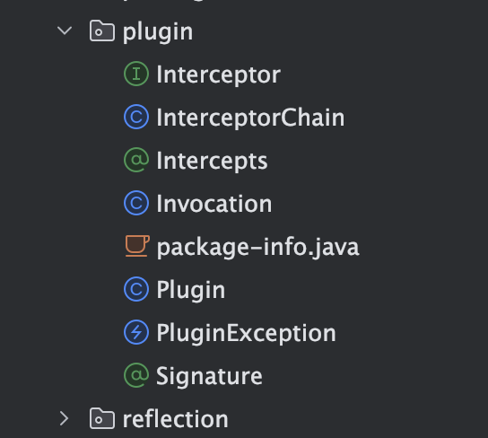

---
category:
  - mybatis
tag:
  - mybatis
---

# Mybatis-插件模块

- 插件模块实际上还是基于Java的jdk代理实现，提供第三方扩展mybatis使用
- 通常我们使用mybatis的插件模块来扩展sql日志的打印，重写sql，分页插件等

## 模块详情



## 静态属性

```java
private final List<Interceptor> interceptors = new ArrayList<>();
```

- 拦截器数组集合

## 类Interceptor

```java
public interface Interceptor {

  // 拦截方法
  Object intercept(Invocation invocation) throws Throwable;

  /**
   * 应用插件
   * @param target 目标对象
   * @return
   */
  default Object plugin(Object target) {
    return Plugin.wrap(target, this);
  }

  // 设置拦截器属性
  default void setProperties(Properties properties) {
    // NOP
  }
```

## 类InterceptorChain

### pluginAll方法

- 应用所有拦截器到指定对象

```java
public Object pluginAll(Object target) {
    for (Interceptor interceptor : interceptors) {
      target = interceptor.plugin(target);
    }
    return target;
  }
```

- 这个方法被四个目标对象使用，一共可以有四种目标对象类型可以被拦截：1）Executor；2）StatementHandler；3）ParameterHandler；4）ResultSetHandler 


- 方法interceptor.plugin(target);在org.apache.ibatis.plugin.Interceptor被实现，

```java
/**
   * 应用插件
   * @param target 目标对象
   * @return
   */
  default Object plugin(Object target) {
    return Plugin.wrap(target, this);
  }
  
  public static Object wrap(Object target, Interceptor interceptor) {
    // 1、获取拦截器所有的签名集合
    Map<Class<?>, Set<Method>> signatureMap = getSignatureMap(interceptor);
    // 2、获取目标对象所属类
    Class<?> type = target.getClass();
    // 3、获取所有接口
    Class<?>[] interfaces = getAllInterfaces(type, signatureMap);
    // 3、1 如果有接口的话：
    if (interfaces.length > 0) {
      // 创建目标对象的jdk proxy 对象
      return Proxy.newProxyInstance(
          type.getClassLoader(),
          interfaces,
          new Plugin(target, interceptor, signatureMap));
    }
    //3、2  没有则返回原始类
    return target;
  }
```

### 方法getSignatureMap

```java
private static Map<Class<?>, Set<Method>> getSignatureMap(Interceptor interceptor) {
    // 基于注解Intercepts和Signature获取内容
    // 获取目标类上的Intercepts注解对象
    Intercepts interceptsAnnotation = interceptor.getClass().getAnnotation(Intercepts.class);
    // issue #251
    if (interceptsAnnotation == null) {
      throw new PluginException("No @Intercepts annotation was found in interceptor " + interceptor.getClass().getName());
    }
    // 获取注解当中的Signature注解集合
    Signature[] sigs = interceptsAnnotation.value();
    Map<Class<?>, Set<Method>> signatureMap = new HashMap<>();
    for (Signature sig : sigs) {
      Set<Method> methods = MapUtil.computeIfAbsent(signatureMap, sig.type(), k -> new HashSet<>());
      try {
        // 获取Signature注解当中配置的Method方法
        Method method = sig.type().getMethod(sig.method(), sig.args());
        methods.add(method);
      } catch (NoSuchMethodException e) {
        throw new PluginException("Could not find method on " + sig.type() + " named " + sig.method() + ". Cause: " + e, e);
      }
    }
    return signatureMap;
  }
```

具体的Intercepts和Signature形式参考插件模块的测试类，如下所示：

```java
@Intercepts({
      @Signature(type = Map.class, method = "get", args = {Object.class})})
  public static class AlwaysMapPlugin implements Interceptor {
    @Override
    public Object intercept(Invocation invocation) {
      return "Always";
    }

  }
```

方法getSignatureMap获取的结果是：


## 类Invocation

### 构造方法

```java
public class Invocation {

  // 目标对象
  private final Object target;
  // 目标对象的方法
  private final Method method;
  // 目标对象所有参数
  private final Object[] args;

  public Invocation(Object target, Method method, Object[] args) {
    this.target = target;
    this.method = method;
    this.args = args;
  }
```


## 类Plugin

### 构造方法

```java

public class Plugin implements InvocationHandler {

  // 实际
  private final Object target;
  private final Interceptor interceptor;
  // 插件的签名集合
  private final Map<Class<?>, Set<Method>> signatureMap;

  private Plugin(Object target, Interceptor interceptor, Map<Class<?>, Set<Method>> signatureMap) {
    this.target = target;
    this.interceptor = interceptor;
    this.signatureMap = signatureMap;
  }
```

### 方法wrap

```java
public static Object wrap(Object target, Interceptor interceptor) {
    // 1、获取拦截器所有的签名集合
    Map<Class<?>, Set<Method>> signatureMap = getSignatureMap(interceptor);
    // 2、获取目标对象所属类
    Class<?> type = target.getClass();
    // 3、获取所有接口
    Class<?>[] interfaces = getAllInterfaces(type, signatureMap);
    // 3、1 如果有接口的话：
    if (interfaces.length > 0) {
      // 创建目标对象的jdk proxy 对象
      return Proxy.newProxyInstance(
          type.getClassLoader(),
          interfaces,
          new Plugin(target, interceptor, signatureMap));
    }
    //3、2  没有则返回原始类
    return target;
  }
```

- 创建目标类的代理对象
- 首先获取拦截器上的集合，参考[方法getSignatureMap]()

- 然后获取目前对象的所有接口getAllInterfaces

```java
private static Class<?>[] getAllInterfaces(Class<?> type, Map<Class<?>, Set<Method>> signatureMap) {
    Set<Class<?>> interfaces = new HashSet<>();
    while (type != null) {
      for (Class<?> c : type.getInterfaces()) {
        if (signatureMap.containsKey(c)) {
          interfaces.add(c);
        }
      }
      type = type.getSuperclass();
    }
    return interfaces.toArray(new Class<?>[0]);
  }
```

- 