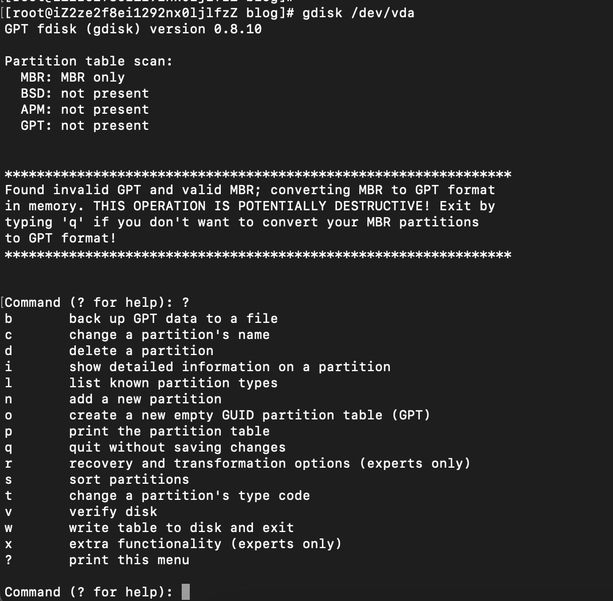
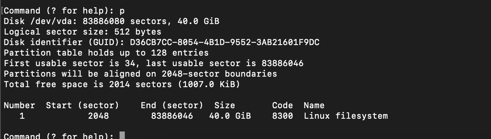

# linux命令-Gdisk命令

- gdisk 命令可以对大于2T的磁盘进行分盘操作，fdisk最大只能分盘2T，
- fdisk 只能用于MBR分区，gdisk可以用用于GPT分区
- 今天工作当中遇到了一个4T的盘进行分盘操作，使用fdisk操作遇到了，改为了gdisk操作

## 安装命令

- 执行`yum install gdisk `

## 相关参数

## 实际操作

- 执行`gdisk /dev/vdb`
- 输入p查看当前分区信息

- 输入d参数，删除执行分区，输入分区编号，可以删除对应分区
- 输入n参数，新建分区，输入分区编号，可以指定心间的分区编号
- 输入w参数，保存分区表