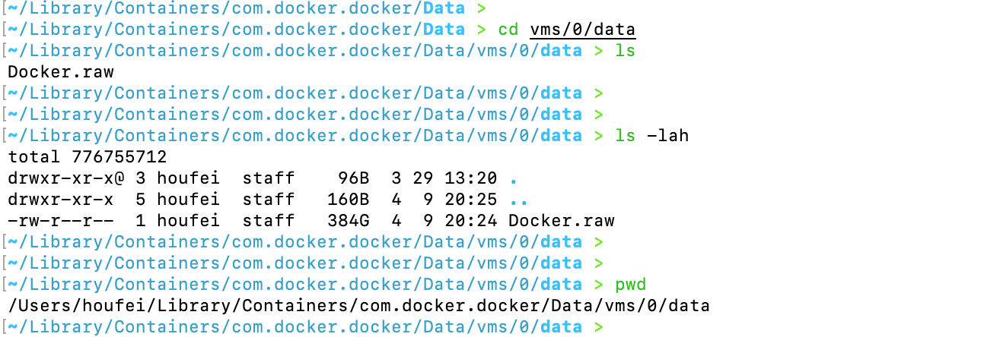
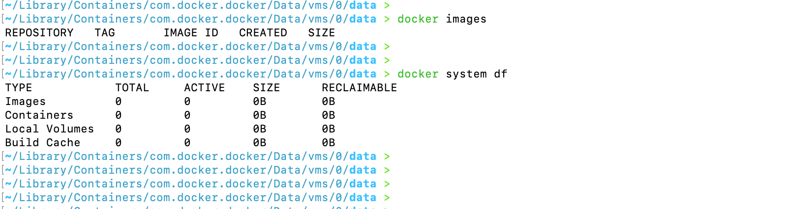

# Docker进阶知识-清理docker数据

- 电脑1t的磁盘现在只有几十G的剩余存储了，
- 使用cleanmac当中查看具体文件占用大小，发现docker目录占用了三百多G
- 控制台进入到指定路径下查看存储大小

- 可以看到占用了384G，进入docker设置当中，点击设置按钮，点击资源查询，可以看到磁盘镜像大小我设置给了40G，之前我给了400G的大小，

- 将这里的disk image size调小，然后点击报错
  - 注意：这里点击缩小之后，会清理掉本机的所有镜像。
- 执行命令`docker system df`查看，可以看到本地镜像存储归0

