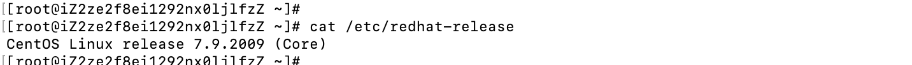
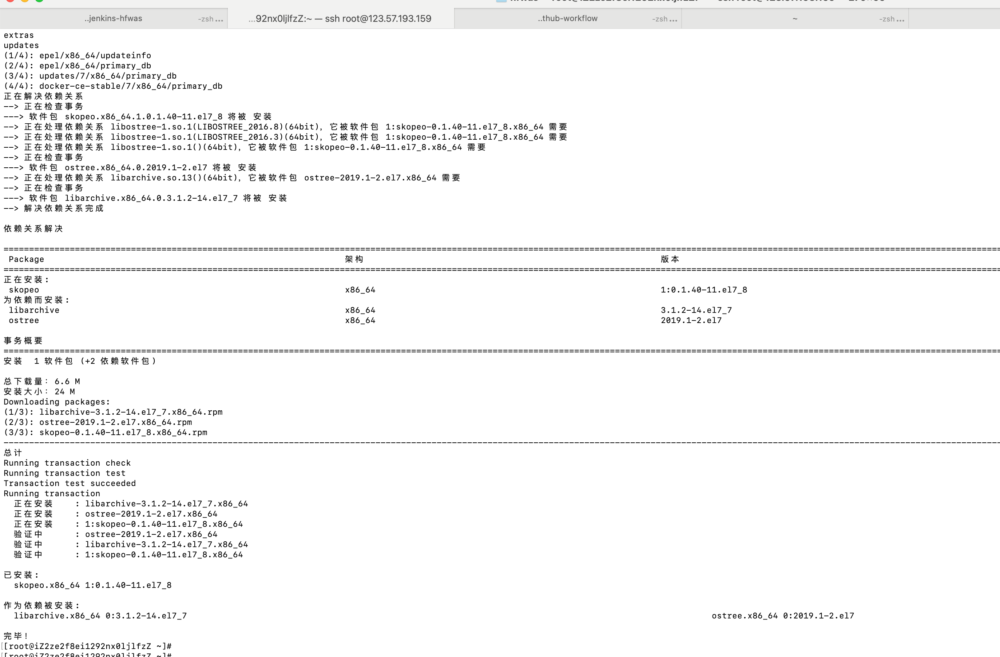
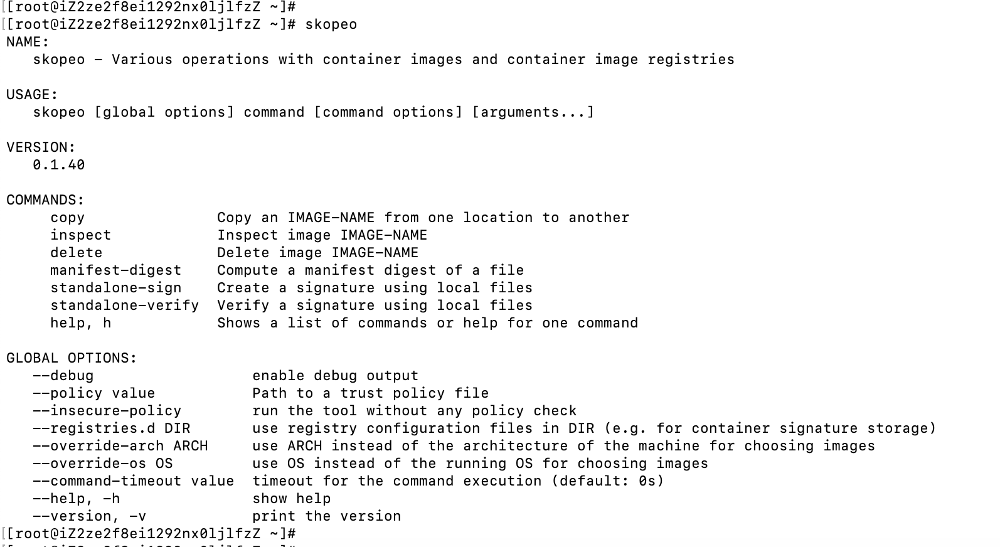
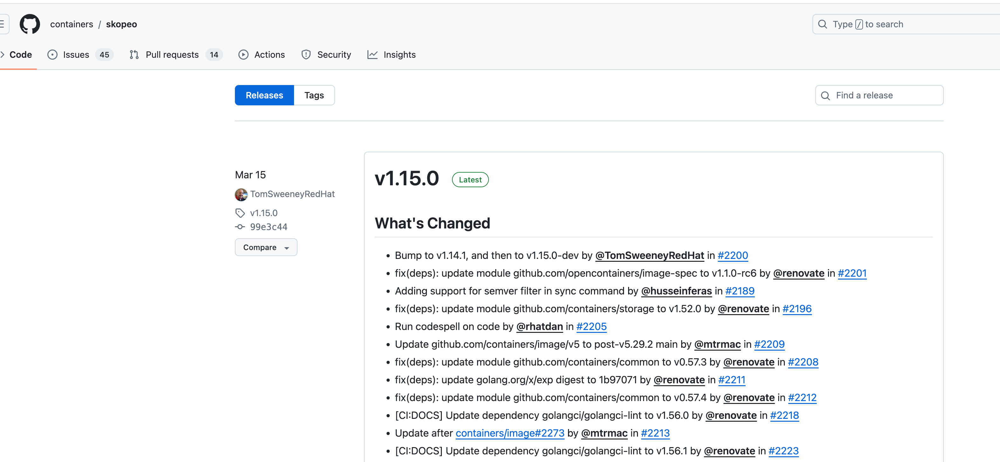

# docker进阶知识-docker镜像同步skopeo

## 安装

- [具体的安装参考官方文档](https://github.com/containers/skopeo/blob/main/install.md)
- 虚拟机环境是centos7.9

- 执行命令`yum -y install skopeo`

- 测试命令，执行`skopeo`

## 升级skopeo版本

- 执行`skopeo --version`发现skopeo版本才只有0.1.40版本，查询github release页面，都已经到了1点几版本，

- 执行命令` skopeo list-tags docker://registry.cn-hangzhou.aliyuncs.com/dkyy/devops-project-svc-v2`还显示没有list-tags参数

- 

