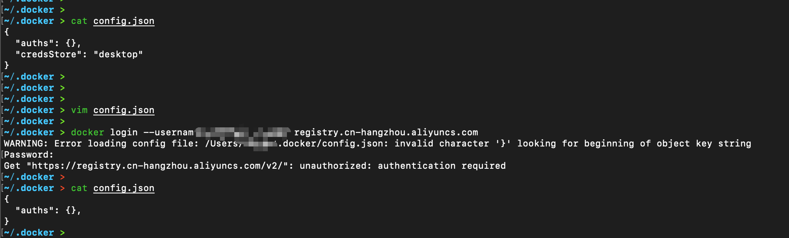
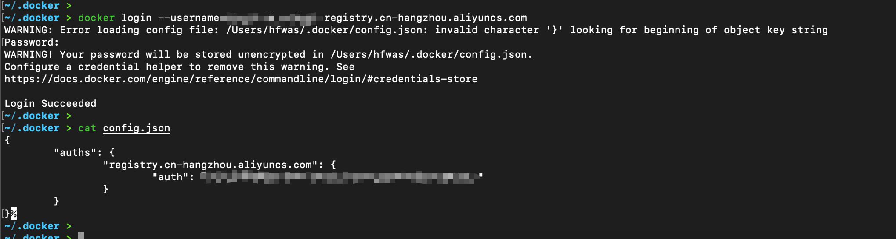

# docker报错-Error saving credentials: error storing credentials - err: exec: "docker-credential-desktop"

- 执行`docker login --username=用户名 registry.cn-hangzhou.aliyuncs.com`，控制台报错：

```
~/.docker > docker login --username=dingtalk_eadbpj registry.cn-hangzhou.aliyuncs.com                                         
Password: 
Error saving credentials: error storing credentials - err: exec: "docker-credential-desktop": executable file not found in $PATH, out: ``
~/.docker > 
```

- 参考资料：`https://stackoverflow.com/questions/65896681/exec-docker-credential-desktop-exe-executable-file-not-found-in-path`


- 删除`config.json`文件当中的内容，修改之后如下图所示：



- 重新执行`docker login`操作，使config.json产生



- 问题解决！！
