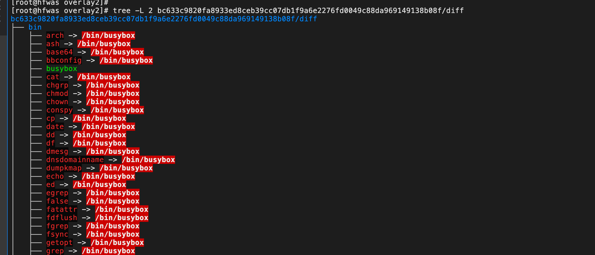
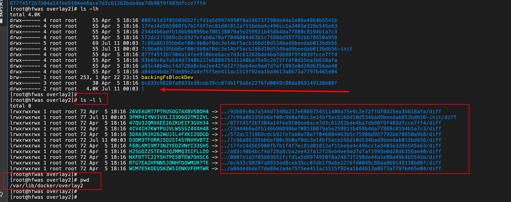
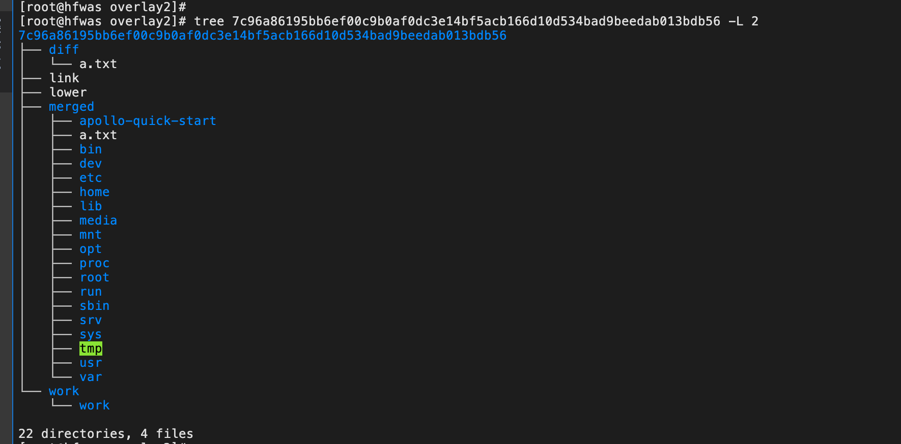

# docker进阶--unionfs

- Docker 公司在实现 Docker 镜像时并没有沿用以前制作 rootfs 的标准流程，而是做了一个小小的创新：Docker 在镜像的设计中，引入了层（layer）的概念。
- 也就是说，用户制作镜像的每一步操作，都会生成一个层，也就是一个增量 rootfs。
- 当然，这个想法不是凭空臆造出来的，而是用到了一种叫作联合文件系统（Union File System）的能力。
- Union File System 也叫 UnionFS，最主要的功能是将多个不同位置的目录联合挂载（union mount）到同一个目录下

## 环境

- Linux hfwas 4.18.0-240.22.1.el8_3.x86_64 #1 SMP Thu Apr 8 19:01:30 UTC 2021 x86_64 x86_64 x86_64 GNU/Linux

## 验证

- 执行`docker info`，可以查看docker的一些基本信息，如下图所示：

```bash
[root@hfwas /]# docker info 
Containers: 2
 Running: 1
 Paused: 0
 Stopped: 1
images: 2
Server Version: 18.06.3-ce
Storage Driver: overlay2
 Backing Filesystem: xfs
 Supports d_type: true
 Native Overlay Diff: true
Logging Driver: json-file
Cgroup Driver: cgroupfs
Plugins:
 Volume: local
 Network: bridge host macvlan null overlay
 Log: awslogs fluentd gcplogs gelf journald json-file logentries splunk syslog
Swarm: inactive
Runtimes: runc
Default Runtime: runc
Init Binary: docker-init
containerd version: 468a545b9edcd5932818eb9de8e72413e616e86e
runc version: a592beb5bc4c4092b1b1bac971afed27687340c5
init version: fec3683
Security Options:
 seccomp
  Profile: default
Kernel Version: 4.18.0-240.22.1.el8_3.x86_64
Operating System: CentOS Linux 8
OSType: linux
Architecture: x86_64
CPUs: 2
Total Memory: 1.675GiB
Name: hfwas
ID: WBVT:SKKS:NGOO:NLYJ:EP5H:CYBI:5EKR:YXZL:73QP:RPJB:F3Y4:PEIG
Docker Root Dir: /var/lib/docker
Debug Mode (client): false
Debug Mode (server): false
Registry: https://index.docker.io/v1/
Labels:
Experimental: false
Insecure Registries:
 101.200.178.253
 127.0.0.0/8
Live Restore Enabled: false

[root@hfwas /]# 
[root@hfwas /]# 
```

- 我们可以发现：Storage Driver: overlay2，下文会用到
- 

## 示例

- 查看镜像列表，执行`docker ./images`


- 执行，


- 可以看到


- 启动容器的前后对比，以下三层是新增的。
  - 7c96a86195bb6ef00c9b0af0dc3e14bf5acb166d10d534bad9beedab013bdb56
  - 7c96a86195bb6ef00c9b0af0dc3e14bf5acb166d10d534bad9beedab013bdb56-init
  - 877f45f2b7304a14fee9106ee6ace7d3c61262bde4ba7db98f9f483dfcce7ff4


- 三层的详细内容如下图所示，

  - 7c96a86195bb6ef00c9b0af0dc3e14bf5acb166d10d534bad9beedab013bdb56-init层

  

  - 7c96a86195bb6ef00c9b0af0dc3e14bf5acb166d10d534bad9beedab013bdb56层

  

  - 877f45f2b7304a14fee9106ee6ace7d3c61262bde4ba7db98f9f483dfcce7ff4层

  

  - 

- 查看之前启动的容器，执行命令
  - 可以看到 overlay2 将 lowerdir、upperdir、workdir 联合挂载。
  - 其中 lowerdir 是容器启动之后的只读层；
  - upperdir 是容器的可读可写层；
  - workdir 是 lowerdir 执行 copy_up 操作的中转层，copy_up 操作是指当要修改的文件不存在于 upperdir 而仅存在于 lower 时，要先将数据从 lower 拷贝到 upper 的这个操作。


- 将容器内部挂载的目录和在主机目录上的对比得知

  - lowerdir=

    - /var/lib/docker/overlay2/l/3FMP4IYNVIVXLI33O6Q2TMIZVL:

    

    - /var/lib/docker/overlay2/l/47QU32QMXXEE26ZKUEIF3GVH34:

    

    - /var/lib/docker/overlay2/l/F6BLKMIXM7INZYEDZVNYI33SH5:

    

    - /var/lib/docker/overlay2/l/H2SGOZZSTEKOJQZMMQ35IFLLDO:

    

    - /var/lib/docker/overlay2/l/NXFDTTC22YSH7PE5BTEW7OHSC6:

    

    - /var/lib/docker/overlay2/l/4IV4IH7KWYPUJVLWSSSZ4XXH4B:

    

    - /var/lib/docker/overlay2/l/5DXA3RJH262WUJIL4FXKI2ODGD:

    

    - /var/lib/docker/overlay2/l/WCM7E5KOEU5KZW5IENKVFEMTWR:

    

    - /var/lib/docker/overlay2/l/26VEAURT7PTHUSOG7AXBV5BOH4:

    

    - /var/lib/docker/overlay2/l/RTG7EA2HFNN5JONHFDOWMUR7TE

    

    - 截图如下所示：

    

  - upperdir=

    - /var/lib/docker/overlay2/7c96a86195bb6ef00c9b0af0dc3e14bf5acb166d10d534bad9beedab013bdb56/diff

  - workdir=

    - /var/lib/docker/overlay2/7c96a86195bb6ef00c9b0af0dc3e14bf5acb166d10d534bad9beedab013bdb56/work

- 那么，再结合前面看到的  目录，那么相当于 Docker 把 lowerdir、upperdir、workdir 涉及到的目录都以联合文件的方式挂载到了 `7c96a86195bb6ef00c9b0af0dc3e14bf5acb166d10d534bad9beedab013bdb56/merged` 目录.

## 容器内创建文件

- 在容器内部创建一个文件


- 查看镜像层变动

  - 7c96a86195bb6ef00c9b0af0dc3e14bf5acb166d10d534bad9beedab013bdb56层
    - 发现只有在diff和merged下有a.txt文件

  

  - 7c96a86195bb6ef00c9b0af0dc3e14bf5acb166d10d534bad9beedab013bdb56-init层

  

  - 877f45f2b7304a14fee9106ee6ace7d3c61262bde4ba7db98f9f483dfcce7ff4层

  


## 总结

- 只读层是 这个镜像的组成内容，这些只读层都以增量的方式包含了 Ubuntu 操作系统的一部分
- init 层，位于只读层和可读可写层之间。这是 Docker 项目单独生成的一个内部层，专门用来存放 /etc/hosts、/etc/hostname、/etc/resolv.conf 等信息
- 可读写层是 rootfs 最上面的一层，专门用来存放修改只读层文件后产生的增量，增删改都发生在这里。之后我们可以还可以使用 docker commit 命令将这个可读写层的内容保存下来，改为只读层，然后更新镜像的信息。
- 而这三层最终被联合挂载到同一个目录下，之后再结合 mount namespace，那么就能为容器中的进程构建出一个完善的文件系统隔离环境

## 参考资料

- 极客时间深入剖析k8s