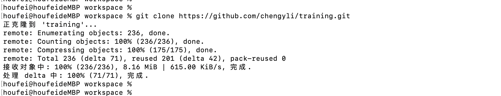
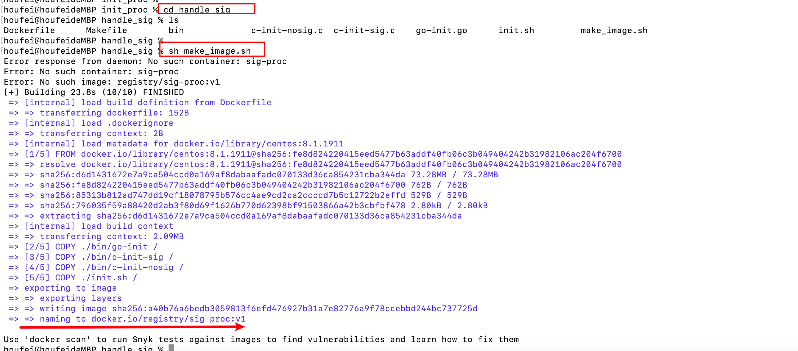
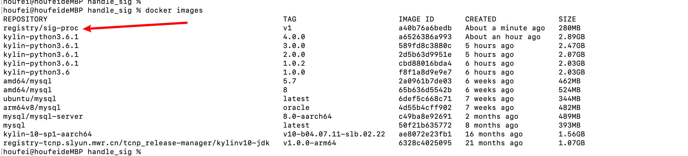
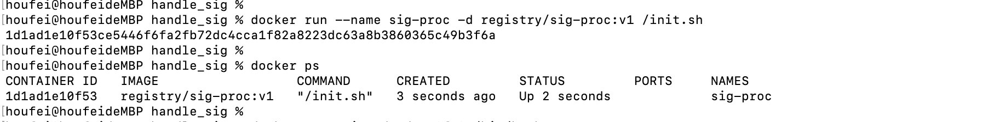
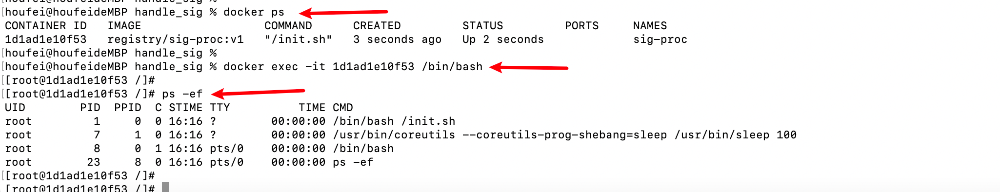
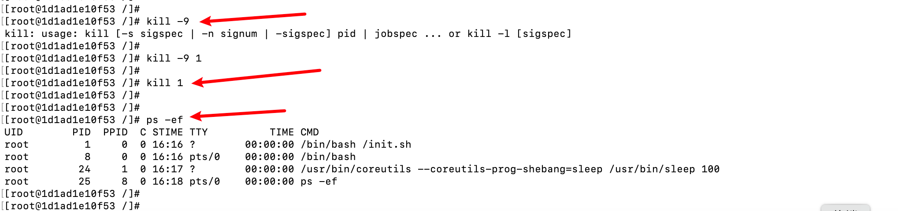
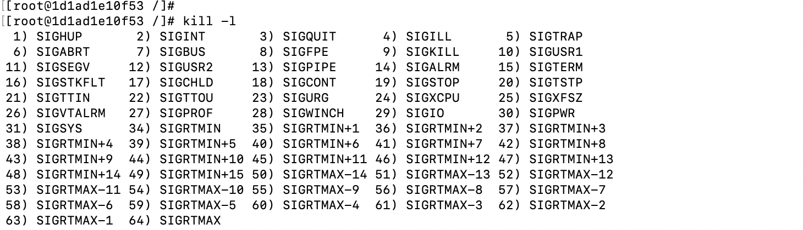

# docker进阶-容器内部1号进程

## 目录

[toc]

## 测试

- 克隆代码`git clone https://github.com/chengyli/training.git`

- 本地构建镜像

- 查看本地镜像列表

- 启动容器，执行`docker run --name sig-proc -d registry/sig-proc:v1 /init.sh`

- 进入容器内部，查看进程

- 容器内部执行kill 1,  kill -9 1，然后查看容器内部进程，发现还是和之前的一样

- 

## init进程

### 来源

- 一个 Linux 操作系统，在系统打开电源，执行 BIOS/boot-loader 之后，就会由 boot-loader 负责加载 Linux 内核。
- Linux 内核执行文件一般会放在 /boot 目录下，文件名类似 vmlinuz*。在内核完成了操作系统的各种初始化之后，这个程序需要执行的第一个用户态程就是 init 进程。内核代码启动 1 号进程的时候，在没有外面参数指定程序路径的情况下，一般会从几个缺省路径尝试执行 1 号进程的代码。这几个路径都是 Unix 常用的可执行代码路径。系统启动的时候先是执行内核态的代码，然后在内核中调用 1 号进程的代码，从内核态切换到用户态。
- 目前主流的 Linux 发行版，无论是 RedHat 系的还是 Debian 系的，都会把 /sbin/init 作为符号链接指向 Systemd。Systemd 是目前最流行的 Linux init 进程，在它之前还有 SysVinit、UpStart 等 Linux init 进程。
- 但无论是哪种 Linux init 进程，它最基本的功能都是创建出 Linux 系统中其他所有的进程，并且管理这些进程
- 在 Linux 上有了容器的概念之后，一旦容器建立了自己的 Pid Namespace（进程命名空间），这个 Namespace 里的进程号也是从 1 开始标记的。
- 所以，容器的 init 进程也被称为 1 号进程。怎么样，1 号进程是不是不难理解？关于这个知识点，你只需要记住： 1 号进程是第一个用户态的进程，由它直接或者间接创建了 Namespace 中的其他进程。

## linux信号

### 信号类型

- 执行`kill -l`命令

- 可以看到linux当中支持了64个信号。
- 信号其实就是linux进程收到的一个通知，

### 信号示例

SIGTERM(15)和SIGKILL(9)

- 对于捕获，这两个信号同样例外，这两个信号不能有用户自己的处理代码，只能执行系统的缺省行为
- SIGTERM
  - 来源：linux命令kill发出的，
  - kill 1,就是通过kill向1号进程发送一个信号，在没有别的参数时，这个信号类型就默认为SIGTERM
  - 处理方式：可以被捕获，用户可以为这个信号注册自己的handler，
- SIGKILL
  - 来源：linux当中两个特权信号之一，
  - 处理方式：
- 特权信号：linux为kernal和超级用户去删除任意进程所保留的，不能被忽略也不能被捕获，进程一旦收到SIGKILL，就要退出。

### 进程处理

- 针对信号，进程处理方式
- 对于每一个信号，进程对它的处理都有下面三个选择。
- 第一个选择是忽略（Ignore），就是对这个信号不做任何处理，但是有两个信号例外，对于 SIGKILL 和 SIGSTOP 这个两个信号，进程是不能忽略的。这是因为它们的主要作用是为 Linux kernel 和超级用户提供删除任意进程的特权。
- 第二个选择，就是捕获（Catch），这个是指让用户进程可以注册自己针对这个信号的 handler。具体怎么做我们目前暂时涉及不到，你先知道就行，我们在后面课程会进行详细介绍。
- 还有一个选择是缺省行为（Default），Linux 为每个信号都定义了一个缺省的行为，你可以在 Linux 系统中运行 man 7 signal来查看每个信号的缺省行为。
- 

## 为什么在容器中不能 kill 1 号进程

- 用c程序作为init进程，尝试杀掉1号进程，和ba sh init进程一样，无论是SIGTERM还是SIGKILL都不能杀掉一号进程
- 用golang程序作为1号进程，执行`kill -9 l`和`kill 1`
  - 执行`kill -9 1`,还是不能杀掉1号进程
  - 执行`kill 1`，SIGTERM这个信号吧1号进程杀掉了，容器退出了
- `kill 1`发生了什么？
  - 
- 

