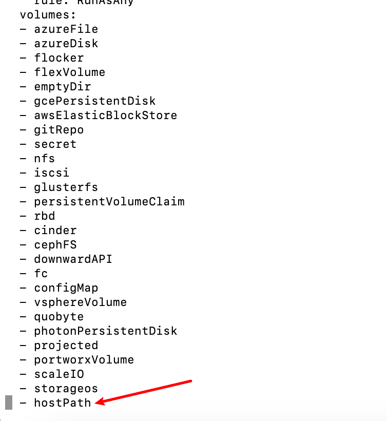

# K8s运维操作-unable to validate against any pod security policy

# 报错信息

- 报错名称：unable to validate against any pod security policy: [spec.volumes[1]: Invalid value: "hostPath": hostPath volumes are not allowed to be used]

- 执行`kubectl -n 命名空间 get psp`

- 查看名称为cluster-podsecuritypolicy的psp

- 执行`kubectl -n 命名空间 edit psp cluster-podsecuritypolicy `

- 添加hostpath内容，

# 参考资料

- https://github.com/kubecost/cost-analyzer-helm-chart/blob/master/cost-analyzer/templates/cost-analyzer-psp.template.yaml