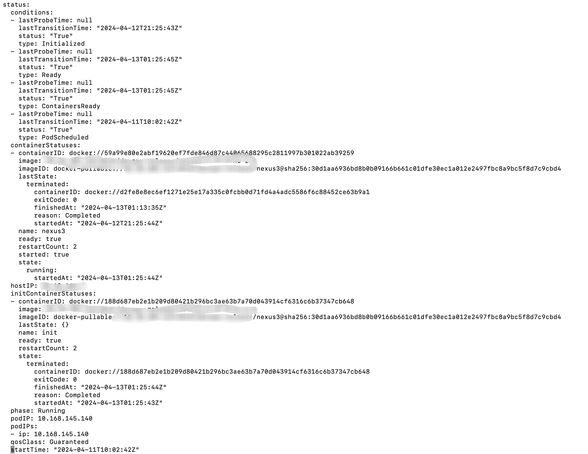

# K8s运维操作-获取pod上次退出原因

- 执行命令`kubectl -n 命名空间 get pod -o wide`，获取命名空间所有pod的状态，
- 输出内容当中有一列字段是：`RESTARTS`重启次数，想要去看pod上一次重启的原因
- 执行命令：`kubectl -n 命名空间 edit pod pod名称  `，pod当中的yaml最下边有一行字段，status表述了pod当中的容器的最后一次状态，以及对应的退出码，退出原因，启动时间，完成时间等，可以查看reason字段去排查pod重启的原因

# 参考资料

- https://github.com/kubecost/cost-analyzer-helm-chart/blob/master/cost-analyzer/templates/cost-analyzer-psp.template.yaml