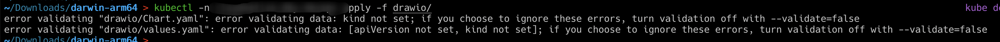
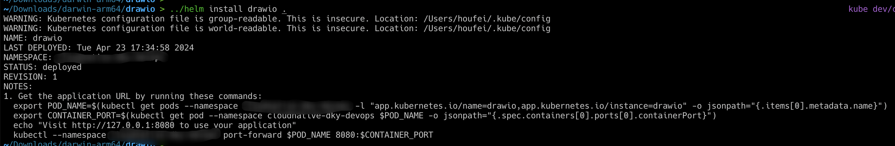

# k8s运维操作-执行apply报错kind not set

- 使用命令`../helm create drawio .`生成helm模版文件，然后修改对应的values.yaml和char.yaml
- 控制台执行`kubectl -n 命名空间 apply -f drawio/`，显示报错，报错信息如下：

- 解决办法：

  - 执行`helm install drawio .`

  