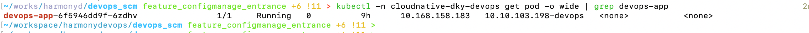
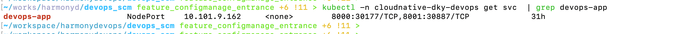
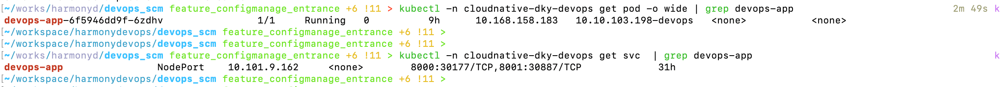
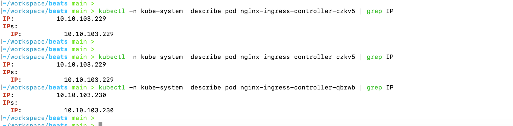
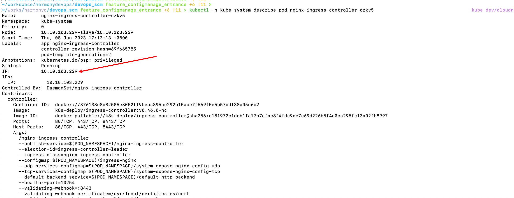
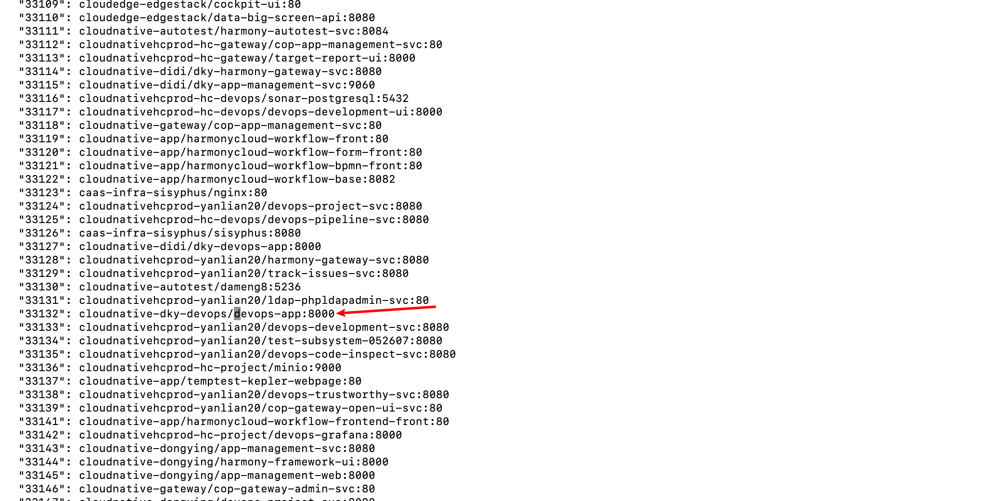

# nginx-controller对外暴露端口

- 服务部署在k8s集群当中，服务pod

- svc列表
  - 30177是服务的有效访问地址

- 服务的访问地址如下：http://10.10.103.198:30177/login

- k8s集群当中部署了nginx-controller，想要通过nginx暴露端口TCP端口出去访问。
- 两个nginx-controller的IP地址：

- nginx-controller的地址：

- 查看nginx-controller对应的cm,执行`kubectl -n kube-system edit cm system-expose-nginx-config-tcp`

- 可以看到我们部署在cloudnative-dky-devops命名空间下的前端devops-app对外暴露了33132端口，我们可以通过 http://10.10.103.229:33132去访问前端。

