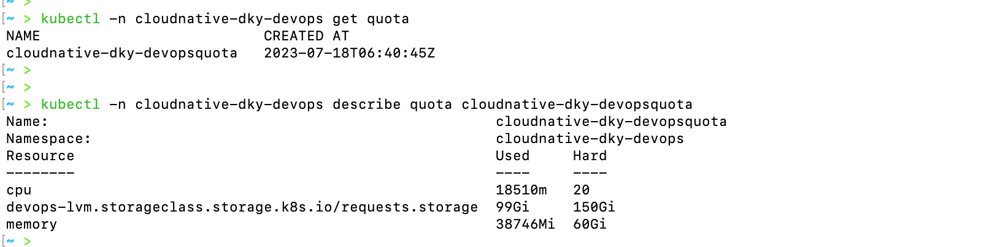
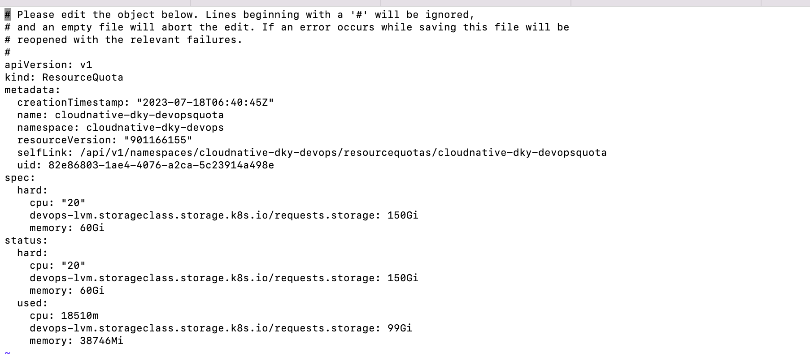

#  K8s进阶操作-k8s限制ns资源

- 通常有两种方式限制资源
  - 一种是：quota，资源名称是resourcequotas，别名是quota，kind是ResourceQuota
    - 限定单个namespace中可使用集群资源的总量，包括两个维度：
      - 限定某个对象类型（如Pod）可创建对象的总数；
      - 限定某个对象类型可消耗的计算资源（CPU、内存）与存储资源（存储卷声明）总数
  - 一种是：limitranges，资源名称是limitranges，别名是limits，kind是LimitRange
    - 是对具体某个Pod或容器的资源使用进行限制。默认情况下，namespace中Pod或容器的资源消耗是不受限制的，这就可能导致某个容器应用内存泄露耗尽资源影响其它应用的情况。Limit Range可以用来限定namespace内Pod（或容器）可以消耗资源的数量。
      - 限制namespace中每个Pod或容器的最小与最大计算资源
      - 限制namespace中每个Pod或容器计算资源request、limit之间的比例
      - 限制namespace中每个存储卷声明（PersistentVolumeClaim）可使用的最小与最大存储空间
      - 设置namespace中容器默认计算资源的request、limit，并在运行时自动注入到容器中
  - 

- 查看当前命名命名空间的资源限制，执行`kubectl -n 命名空间 get quota `

- 修改命名空间的资源限制，执行`kubectl -n 命名空间 edit quota cloudnative-dky-devopsquota `

- 