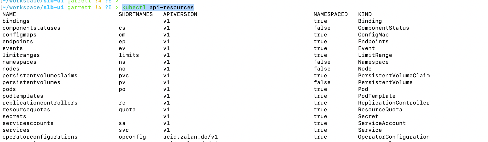
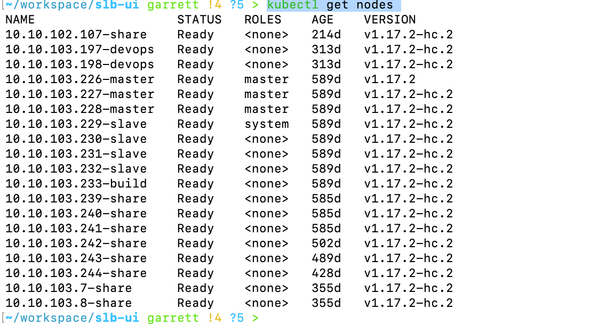
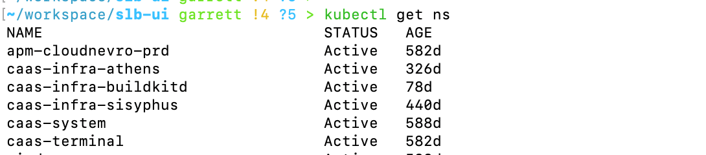
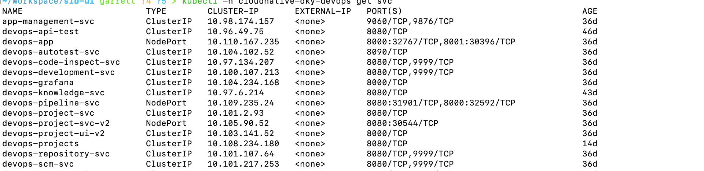
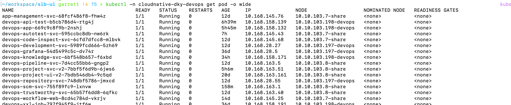
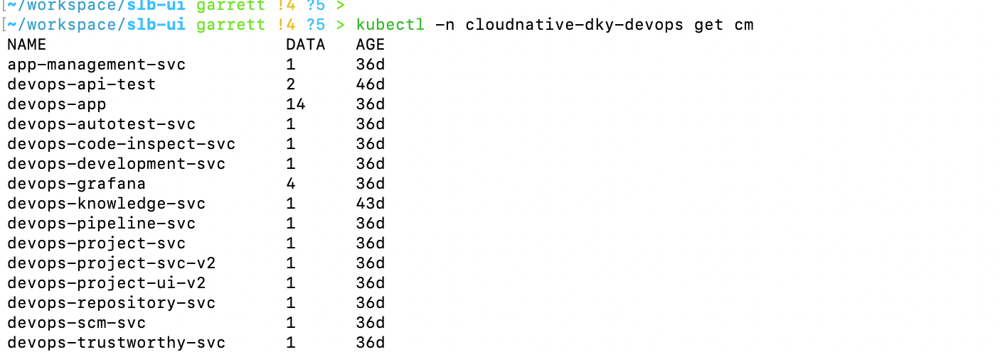
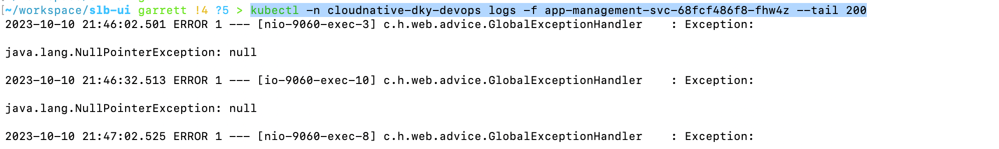
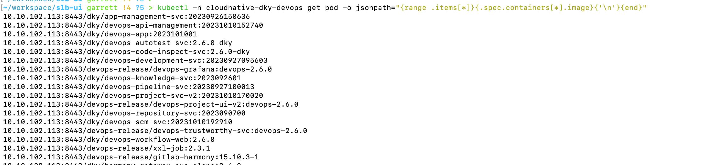
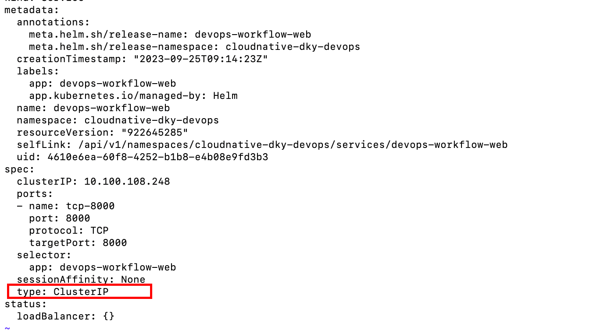

#  K8s进阶操作-k8sCommand

- 查看k8s提供的所有资源对象，执行`kubectl api-resources`

- 查看集群节点，状态，IP，执行`kubectl get nodes `

- 查看所有的命名空间，`kubectl get ns `

- 查看命名空间下的所有服务，执行`kubectl -n cloudnative-dky-devops get svc`

- 查看命名空间下的所有实例，执行`kubectl -n cloudnative-dky-devops get pod -o wide`

- 查看命名空间下的所有配置文件，执行`kubectl -n cloudnative-dky-devops get cm`

- 查看服务日志，执行`kubectl -n cloudnative-dky-devops logs -f app-management-svc-68fcf486f8-fhw4z --tail 200`

- 获取实例的多个容器，执行`kubectl -n cloudnative-dky-devops logs -f app-management-svc-68fcf486f8-fhw4z`
- 查看实例的某个容器当中的日志，执行`kubectl -n cloudnative-dky-devops logs -f app-management-svc-68fcf486f8-fhw4z -c 容器名称 --tail 200 `

- 获取命名空间下的所有服务实例的镜像集合，执行`kubectl -n cloudnative-dky-devops get pod -o jsonpath="{range .items[*]}{.spec.containers[*].image}{'\n'}{end}"`

- 手动修改服务类型，将ClusterIP类型修改为NodePort，执行`kubectl -n cloudnative-dky-devops edit svc devops-workflow-web`，将ClusterIP修改为NodePort，然后保存退出即可

- 查看pod日志，筛选时间范围，从什么时候到什么时间，执行`kubectl -n 命名空间 --since=时间 --util=时间 logs -f po d名称`

- 
