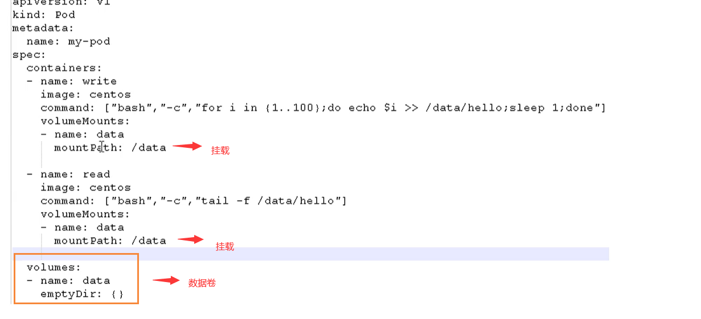
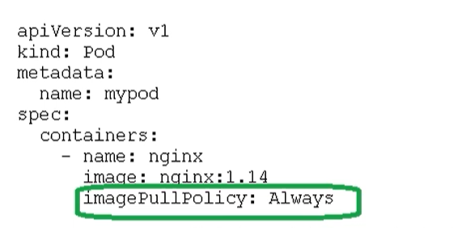
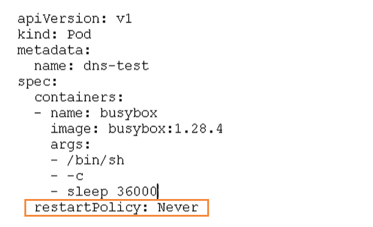
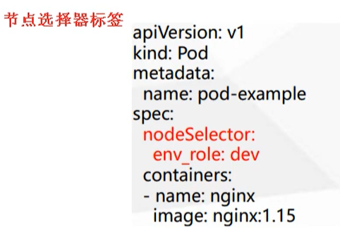

# K8s基础知识-核心技术Pod

## Pod概述

Pod是K8S系统中可以创建和管理的最小单元，是资源对象模型中由用户创建或部署的最小资源对象模型，也是在K8S上运行容器化应用的资源对象，其它的资源对象都是用来支撑或者扩展Pod对象功能的，比如控制器对象是用来管控Pod对象的，Service或者Ingress资源对象是用来暴露Pod引用对象的，PersistentVolume资源对象是用来为Pod提供存储等等，K8S不会直接处理容器，而是Pod，Pod是由一个或多个container组成。

Pod是Kubernetes的最重要概念，每一个Pod都有一个特殊的被称为 “根容器”的Pause容器。Pause容器对应的镜像属于Kubernetes平台的一部分，除了Pause容器，每个Pod还包含一个或多个紧密相关的用户业务容器。


### Pod基本概念

- 最小部署的单元
- Pod里面是由一个或多个容器组成【一组容器的集合】
- 一个pod中的容器是共享网络命名空间
- Pod是短暂的
- 每个Pod包含一个或多个紧密相关的用户业务容器

### Pod存在的意义

- 创建容器使用docker，一个docker对应一个容器，一个容器运行一个应用进程
- Pod是多进程设计，运用多个应用程序，也就是一个Pod里面有多个容器，而一个容器里面运行一个应用程序


- Pod的存在是为了亲密性应用
  - 两个应用之间进行交互
  - 网络之间的调用【通过127.0.0.1 或 socket】
  - 两个应用之间需要频繁调用

Pod是在K8S集群中运行部署应用或服务的最小单元，它是可以支持多容器的。Pod的设计理念是支持多个容器在一个Pod中共享网络地址和文件系统，可以通过进程间通信和文件共享这种简单高效的方式组合完成服务。同时Pod对多容器的支持是K8S中最基础的设计理念。在生产环境中，通常是由不同的团队各自开发构建自己的容器镜像，在部署的时候组合成一个微服务对外提供服务。

Pod是K8S集群中所有业务类型的基础，可以把Pod看作运行在K8S集群上的小机器人，不同类型的业务就需要不同类型的小机器人去执行。目前K8S的业务主要可以分为以下几种

- 长期伺服型：long-running
- 批处理型：batch
- 节点后台支撑型：node-daemon
- 有状态应用型：stateful application

上述的几种类型，分别对应的小机器人控制器为：Deployment、Job、DaemonSet 和 StatefulSet  (后面将介绍控制器)

## Pod实现机制

主要有以下两大机制

- 共享网络
- 共享存储

### 共享网络

容器本身之间相互隔离的，一般是通过 **namespace** 和 **group** 进行隔离，那么Pod里面的容器如何实现通信？

- 首先需要满足前提条件，也就是容器都在同一个**namespace**之间

关于Pod实现原理，首先会在Pod会创建一个根容器： `pause容器`，然后我们在创建业务容器 【nginx，redis 等】，在我们创建业务容器的时候，会把它添加到 `info容器` 中

而在 `info容器` 中会独立出  ip地址，mac地址，port 等信息，然后实现网络的共享


完整步骤如下

- 通过 Pause 容器，把其它业务容器加入到Pause容器里，让所有业务容器在同一个名称空间中，可以实现网络共享

### 共享存储

Pod持久化数据，专门存储到某个地方中


使用 Volumn数据卷进行共享存储，案例如下所示



## Pod镜像拉取策略

我们以具体实例来说，拉取策略就是 `imagePullPolicy`



拉取策略主要分为了以下几种

- IfNotPresent：默认值，镜像在宿主机上不存在才拉取
- Always：每次创建Pod都会重新拉取一次镜像
- Never：Pod永远不会主动拉取这个镜像

## Pod资源限制

也就是我们Pod在进行调度的时候，可以对调度的资源进行限制，例如我们限制 Pod调度是使用的资源是 2C4G，那么在调度对应的node节点时，只会占用对应的资源，对于不满足资源的节点，将不会进行调度


### 示例

我们在下面的地方进行资源的限制


这里分了两个部分

- request：表示调度所需的资源
- limits：表示最大所占用的资源

## Pod重启机制

因为Pod中包含了很多个容器，假设某个容器出现问题了，那么就会触发Pod重启机制



重启策略主要分为以下三种

- Always：当容器终止退出后，总是重启容器，默认策略 【nginx等，需要不断提供服务】
- OnFailure：当容器异常退出（退出状态码非0）时，才重启容器。
- Never：当容器终止退出，从不重启容器 【批量任务】

## Pod健康检查

通过容器检查，原来我们使用下面的命令来检查

```bash
kubectl get pod
```

但是有的时候，程序可能出现了 **Java** 堆内存溢出，程序还在运行，但是不能对外提供服务了，这个时候就不能通过 容器检查来判断服务是否可用了

这个时候就可以使用应用层面的检查

```bash
# 存活检查，如果检查失败，将杀死容器，根据Pod的restartPolicy【重启策略】来操作
livenessProbe

# 就绪检查，如果检查失败，Kubernetes会把Pod从Service endpoints中剔除
readinessProbe
```


Probe支持以下三种检查方式

- http Get：发送HTTP请求，返回200 - 400 范围状态码为成功
- exec：执行Shell命令返回状态码是0为成功
- tcpSocket：发起TCP Socket建立成功

## Pod调度策略

### 创建Pod流程

- 首先创建一个pod，然后创建一个API Server 和 Etcd【把创建出来的信息存储在etcd中】
- 然后创建 Scheduler，监控API Server是否有新的Pod，如果有的话，会通过调度算法，把pod调度某个node上
- 在node节点，会通过 `kubelet -- apiserver ` 读取etcd 拿到分配在当前node节点上的pod，然后通过docker创建容器


### 影响Pod调度的属性

Pod资源限制对Pod的调度会有影响

#### 根据request找到足够node节点进行调度


#### 节点选择器标签影响Pod调度



关于节点选择器，其实就是有两个环境，然后环境之间所用的资源配置不同


我们可以通过以下命令，给我们的节点新增标签，然后节点选择器就会进行调度了

```bash
kubectl label node node1 env_role=prod
```


#### 节点亲和性

节点亲和性 **nodeAffinity** 和 之前nodeSelector 基本一样的，根据节点上标签约束来决定Pod调度到哪些节点上

- 硬亲和性：约束条件必须满足
- 软亲和性：尝试满足，不保证


支持常用操作符：in、NotIn、Exists、Gt、Lt、DoesNotExists

反亲和性：就是和亲和性刚刚相反，如 NotIn、DoesNotExists等


## 污点和污点容忍

### 概述

nodeSelector 和 NodeAffinity，都是Prod调度到某些节点上，属于Pod的属性，是在调度的时候实现的。

Taint 污点：节点不做普通分配调度，是节点属性

### 场景

- 专用节点【限制ip】
- 配置特定硬件的节点【固态硬盘】
- 基于Taint驱逐【在node1不放，在node2放】

### 查看污点情况

```bash
kubectl describe node k8smaster | grep Taint
```


污点值有三个

- NoSchedule：一定不被调度
- PreferNoSchedule：尽量不被调度【也有被调度的几率】
- NoExecute：不会调度，并且还会驱逐Node已有Pod

### 未节点添加污点

```bash
kubectl taint node [node] key=value:污点的三个值
```

举例：

```bash
kubectl taint node k8snode1 env_role=yes:NoSchedule
```

### 删除污点

```bash
kubectl taint node k8snode1 env_role:NoSchedule-
```


### 演示

我们现在创建多个Pod，查看最后分配到Node上的情况

首先我们创建一个 nginx 的pod

```bash
kubectl create deployment web --image=nginx
```

然后使用命令查看

```bash
kubectl get pods -o wide
```


我们可以非常明显的看到，这个Pod已经被分配到 k8snode1 节点上了

下面我们把pod复制5份，在查看情况pod情况

```bash
kubectl scale deployment web --replicas=5
```

我们可以发现，因为master节点存在污点的情况，所以节点都被分配到了 node1 和 node2节点上


我们可以使用下面命令，把刚刚我们创建的pod都删除

```bash
kubectl delete deployment web
```

现在给了更好的演示污点的用法，我们现在给 node1节点打上污点

```bash
kubectl taint node k8snode1 env_role=yes:NoSchedule
```

然后我们查看污点是否成功添加

```bash
kubectl describe node k8snode1 | grep Taint
```


然后我们在创建一个 pod

```bash
# 创建nginx pod
kubectl create deployment web --image=nginx
# 复制五次
kubectl scale deployment web --replicas=5
```

然后我们在进行查看

```bash
kubectl get pods -o wide
```

我们能够看到现在所有的pod都被分配到了 k8snode2上，因为刚刚我们给node1节点设置了污点


最后我们可以删除刚刚添加的污点

```bash
kubectl taint node k8snode1 env_role:NoSchedule-
```

### 污点容忍

污点容忍就是某个节点可能被调度，也可能不被调度

