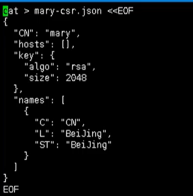

# K8s基础知识-集群安全机制

## 概述

当我们访问K8S集群时，需要经过三个步骤完成具体操作

- 认证
- 鉴权【授权】
- 准入控制

进行访问的时候，都需要经过 apiserver， apiserver做统一协调，比如门卫

- 访问过程中，需要证书、token、或者用户名和密码
- 如果访问pod需要serviceAccount


### 认证

对外不暴露8080端口，只能内部访问，对外使用的端口6443

客户端身份认证常用方式

- https证书认证，基于ca证书
- http token认证，通过token来识别用户
- http基本认证，用户名 + 密码认证

### 鉴权

基于RBAC进行鉴权操作

基于角色访问控制

### 准入控制

就是准入控制器的列表，如果列表有请求内容就通过，没有的话 就拒绝

## RBAC介绍

基于角色的访问控制，为某个角色设置访问内容，然后用户分配该角色后，就拥有该角色的访问权限


k8s中有默认的几个角色

- role：特定命名空间访问权限
- ClusterRole：所有命名空间的访问权限

角色绑定

- roleBinding：角色绑定到主体
- ClusterRoleBinding：集群角色绑定到主体

主体

- user：用户
- group：用户组
- serviceAccount：服务账号

## RBAC实现鉴权

- 创建命名空间


### 创建命名空间

我们可以首先查看已经存在的命名空间

```bash
kubectl get namespace
```


然后我们创建一个自己的命名空间  roledemo

```bash
kubectl create ns roledemo
```

### 命名空间创建Pod

为什么要创建命名空间？因为如果不创建命名空间的话，默认是在default下

```bash
kubectl run nginx --image=nginx -n roledemo
```

### 创建角色

我们通过 rbac-role.yaml进行创建


tip：这个角色只对pod 有 get、list权限

然后通过 yaml创建我们的role

```bash
# 创建
kubectl apply -f rbac-role.yaml
# 查看
kubectl get role -n roledemo
```


### 创建角色绑定

我们还是通过 role-rolebinding.yaml 的方式，来创建我们的角色绑定


然后创建我们的角色绑定

```bash
# 创建角色绑定
kubectl apply -f rbac-rolebinding.yaml
# 查看角色绑定
kubectl get role, rolebinding -n roledemo
```


### 使用证书识别身份

我们首先得有一个 rbac-user.sh 证书脚本




这里包含了很多证书文件，在TSL目录下，需要复制过来

通过下面命令执行我们的脚本

```bash
./rbac-user.sh
```

最后我们进行测试

```bash
# 用get命令查看 pod 【有权限】
kubectl get pods -n roledemo
# 用get命令查看svc 【没权限】
kubectl get svc -n roledmeo
```

