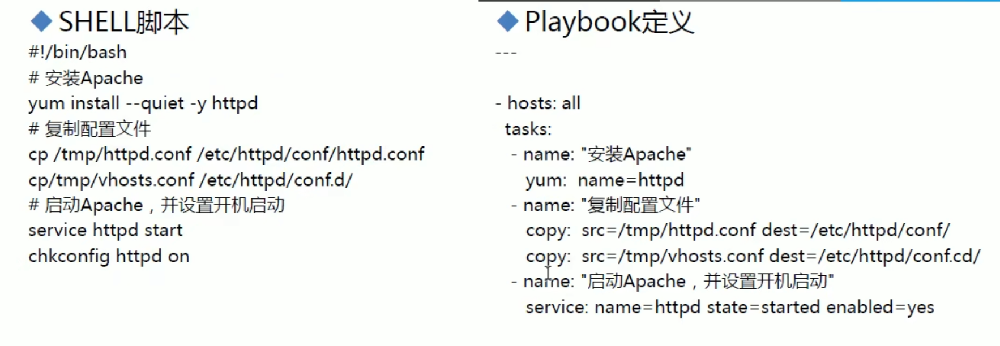

# Ansible-Playbook

## ansible-galaxy

- ansible-galaxy
  - 连接https://galaxy.ansible..com下载相应的roles
  - 列出所有已安装的galaxy
    - ansible-galaxy list
  - 安装galaxy
    - ansible-galaxy install geerlingguy.redis
  - 删除galaxy
    - ansible-galaxy remove geerlingguy.redis

- ansible-pull
  - 推送命令至远程，效率无限提升，对运维要求较高
- Ansible-playbook

```yaml
ansible-playbook hello.yml
cat hello.yml
#hello world yml file
- hosts: websrvs
  remote_user: root
  tasks:
    - name: hello world
    	command: /usr/bin/wall hello world
```

## Ansible-vault

- Ansible-vault
  - 功能：管理加密解密yml文件
  - ansible-vault  [create|decrypt|edit | encrypt|rekey|view]
  - ansible-vault encrypt hello.yml加密
  - ansible-vault decrypt hello.yml解密
  - ansible-vault view hello.yml查看
  - ansible-vault edit hello.yml编辑加密文件
  - ansible-vault rekey hello.yml修改口令
  - ansible-vault create new.yml创建新文件

- Ansible-console:2.0+新增，可交互执行命令，支持tab
  - root@test(2)[f:10]$
    执行用户@当前操作的主机组（当前组的主机数量）[f:并发数]$
  - 设置并发数：forks n，例如：forks10
  - 切换组：cd主机组，例如：cd web
  - 列出当前组主机列表：list
  - 列出所有的内置命令：？或help
  - 示例：
    - root@all (2)[f:5]$ list
    - root@all (2)[f:5]$ cd appsrvs
    - root@appsrvs(2)[f:5]$ list
    - root@appsrvs(2)[f:5]$yum name=httpd state=present
    - root@appsrvs(2)[f:5]$ service name=httpd state=started

- playbook是由一个或多个"play"组成的列表
- play的主要功能在于将事先归并为一组的主机装扮成事先通过ansiblet中的task定义好的角色。从根本上来讲，所谓task无非是调用ansible的一个module。将多个ply组织在一个playbook中，即可以让它们联同起来按事先编排的机制同唱一台大戏
- Playbook采用YAML语言编写

## Yaml介绍

- YAML是一个可读性高的用来表达资料序列的格式。YAML参考了其他多种语言，包括：XML，C语言、Python、Perl以及电子邮件格式RFC2822等。Clark Evans在2001年在首次发表了这种语言，另外Ingy dδtNet与Oren Ben-Kiki也是这语言的共同设计者
- YAML Ain't Markup Language,即YAML不是XML。不过，在开发的这种语言时，YAML的意思其实是："Yet Another Markup Language"(仍是一种标记语言)
- 特性
  - YAML的可读性好
  - YAML和脚本语言的交互性好
  - YAML使用实现语言的数据类型
  - YAML有一个一致的信息模型
  - YAML易于实现
  - YAML可以基于流来处理
  - YAML表达能力强，扩展性好
- 更多的内容及规范参见http:/www.yaml.org

- 语法简介
  - 在单一档案中，可用连续三个连字号（一）区分多个档案。另外，还有选择性的连续三个点号
    （…)用来表示档案结尾
  - 次行开始正常写Playbook的内容，一般建议写明该Playbook的功能
  - 使用#号注释代码
  - 缩进必须是统一的，不能空格和tab混用
  - 缩进的级别也必须是一致的，同样的缩进代表同样的级别，程序判别配置的级别是通过缩进结合换行来实现的
  - YAML文件内容和Liux系统大小写判断方式保持一致，是区别大小写的，k/v的值均需大小写敏感
  - k/v的值可同行写也可换行写。同行使用：分隔
  - v可是个字符串，也可是另一个列表
  - 一个完整的代码块功能需最少元素需包括name:task
  - 一个name只能包括一个task
  - YAML文件扩展名通常为yml或yaml

## playbook 核心元素

- Hosts 执行的远程主机列表
- Tasks 任务集
- Varniables 内置变量或自定义变量在playbook中调用
- Templates模板，可替换模板文件中的变量并实现一些简单逻辑的文件
- Handlers和notity结合使用，由特定条件触发的操作，满足条件方才执行，否则不执行
- tags标签指定某条任务执行，用于选择运行playbook中的部分代码。ansible具有幂等性，因此会自动跳过没有变化的部分，即便如此，有些代码为测试其确实没有发生变化的时间依然会非常地长。此时，如果确信其没有变化，就可以通过tags跳过此些代码片断
  - ansible-playbook  -t tagsname  useradd.yml

### Hosts

- playbook中的每一个play的目的都是为了让某个或某些主机以某个指定的用户身份执行任务。hosts)用于指定要执行指定任务的主机，须事先定义在主机清单中
- 可以是如下形式：
  - one.example.com
  - one.example.com:two.example.com
  - 192.168.1.50
  - 192.168.1.*
- Websrvs:dbsrvs两个组的并集
- Websrvs:&dbsrvs两个组的交集
- webservers:!phoenix在websrvs组，但不在dbsrvs组
- 示例：
  - hosts:websrvs dbsrvs

### remote_user

- remote_user:可用于Host和task中。也可以通过指定其通过sudo的方式在远程主机上执行任务，其可用于ply全局或某任务；此外，甚至可以在sudo时使用sudo_user指定sudo时切换的用户

```yaml
- hosts:websrvs
	remote_user:root
	
	tasks:
		- name:test connection
			ping:
			remote_user:magedu
			sudo:yes      默认sudo为root
      sudo_user:wang     sudo为wang
```

### task

- play的主体部分是task list。task list中的各任务按次序逐个在hosts中指定的所有主机上执行，即在所有主机上完成第一个任务后再开始第二个。在运行自下而下某playbookl时，如果中途发生错误，所有已执行任务都将回滚，因此，在更正playbook,后重新执行一次即可
- task的目的是使用指定的参数执行模块，而在模块参数中可以使用变量。模块执行是幂等的，这意味着多次执行是安全的，因为其结果均一致每个task都应该有其name,用于playbook的执行结果输出,建议其内容尽可能清晰地描述任务执行步骤。如果未提供name,则action的结果将用于输出

- tasks:任务列表
- 格式：
  - (I)action:module arguments
  - (2)module:arguments  建议使用
- 注意：shell和commandi模块后面跟命令，而非key=value某任务的状态在运行后为changed时，可通过“notify"通知给相应handlers
- 任务可以通过"tags"打标签，而后可在ansible-playbook命令上使用-t指定进行调用
- 示例：

```yaml
tasks:
  - name:disable selinux
  	command:/sbin/setenforce 0
```

- 如果命令或脚本的退出码不为零，可以使用如下方式替代

```yaml
tasks:
  - name:run this command and ignore the result
    shell:/usr/bin/somecommand /bin/true	
```

- 或者使用ignore_errors:来忽略错误信息：

```yaml
tasks:
  - name:run this command and ignore the result
    shell:/usr/bin/somecommand
    ignore_errors:True
```

## 运行playbook的方式

- ansible-playbook <filename.yml>..[options]

- 常见选项
  - -check只检测可能会发生的改变，但不真正执行操作
  - -list-hosts列出运行任务的主机
  - -imit主机列表只针对主机列表中的主机执行
  - -V显示过程-W-WW更详细
- 示例
  - ansible-playbook file.yml-check只检测
  - ansible-playbook file.yml
  - ansible-playbook file.yml --limit websrvs

## Playbook vs shell 

- copy 不能直接使用两个copy，需要在写一个name 



## handlers和notify结合使用触发条件

- Handlers
  - 是task列表，这些task与前述的task并没有本质上的不同，用于当关注的资源发生变化时，才会采取一定的操作
- Notify此action可用于在每个play的最后被触发，这样可避免多次有改变发生时每次都执行指定的操作，仅在所有的变化发生完成后一次性地执行指定操作。在notify中列出的操作称为handler,也即notify中调用handler中定义的操作

## 变量的使用

- 变量名：仅能由字母、数字和下划线组成，且只能以字母开头
  
- 变量来源：
  
  - ansible setup facts远程主机的所有变量都可直接调用
  - 在/etc/ansible/hosts中定义
    - 普通变量：主机组中主机单独定义，优先级高于公共变量
    - 公共（组）变量：针对主机组中所有主机定义统一变量
  - 通过命令行指定变量，优先级最高 ansible-playbook -e varname=value
  - 在playbook中定义
  
  ```
  vars:
    - var1:value1
    - var2:value2
  ```
  
  - 在role中定义
  
- 变量命名

  - 变量名仅能由字母、数字和下划线组成，且只能以字母开头

- 变量定义：key=value

  - 示例：http_port=80

- 变量调用方式：

  - 通过双括号variable_name调用变量，且变量名前后必须有空格，有时用双括号variable_name才生效
  - ansible-playbook-e选项指定
    - ansible-playbook test.yml -e "hosts=www user=mageedu"

- 主机变量
  - 可以在inventory中定义主机时为其添加主机变量以便于在playbook中使用
  - 示例：

```
[websrvs]
www1.magedu.com http_port=80 maxRequestsPerChild=808
www2.magedu.com http_port=8080 maxRequestsPerChild=909
```

- 组变量
  - 组变量是指赋予给指定组内所有主机上的在playbook中可用的变量
  - 示例：

```
[websrvs]
www1.magedu.com
www2.magedu.com
[websrvs:vars]
ntp_server=ntp.magedu.com
nfs_server=nfs.magedu.com
```

- 普通变量

```
[websrvs]
192.168.99.101 http_port=8080 hname=www1
192.168.99.102 http_port=80 hname=www2
```

- 公共（组）变量

```
[websvrs:vars]
http_port=808
mark=""
[websrvs]
192.168.99.101 http_port=8080 hname=www1
192.168.99.102 http_port=80 hname=www2
ansible websvrs -m hostname -a 'name={{ hname }} {{ mark }} {{ http_port }}
```

- 命令行指定变量：

```
ansible websvrs -e http_port=8000-m hostname-a 'name={{ hname }} {{ mark }} {{ http_port }}
```

