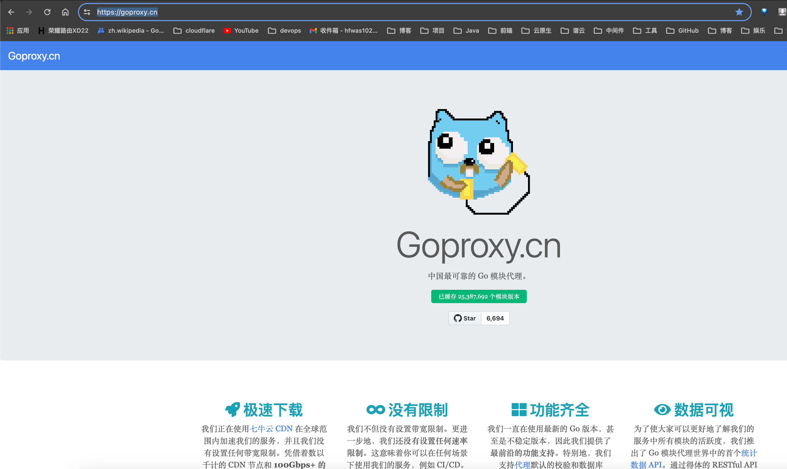

# Nexus操作-下载go依赖

- 中国境内我们事通过goproxy代理来下载go依赖，
- 具体参考goproxy的官网信息：`https://goproxy.cn/`



- 脚本会按照go.sum 当中的依赖列表去下载所有版本的依赖到本地机器上，脚本如下：

```bash
#!/bin/bash
convert_to_exclamation() {
  local result=()
  for word in "${@}"; do
    if [[ "${word}" =~ ^[A-Z] ]]; then
      new_word="!$(echo "$word" | tr 'A-Z' 'a-z')"
    else
      new_word="$word"
    fi
    result+=("$new_word")
  done

  if [ ${#result[@]} -eq 1 ]; then
    path=(${result[@]// / })
    echo "${result[@]}"
  elif [ ${#result[@]} -eq 2 ]; then
    path=(${result[@]// / })
    echo "${path[0]}/${path[1]}"
  elif [ ${#result[@]} -eq 3 ]; then
    path=(${result[@]// / })
    echo "${path[0]}/${path[1]}/${path[2]}"
  elif [ ${#result[@]} -eq 4 ]; then
    path=(${result[@]// / })
    echo "${path[0]}/${path[1]}/${path[2]}/${path[3]}"
  elif [ ${#result[@]} -eq 5 ]; then
    path=(${result[@]// / })
    echo "${path[0]}/${path[1]}/${path[2]}/${path[3]}/${path[4]}"
  elif [ ${#result[@]} -eq 6 ]; then
      path=(${result[@]// / })
      echo "${path[0]}/${path[1]}/${path[2]}/${path[3]}/${path[4]}/${path[5]}"
  fi
}
# Get all dependencies from go.sum
DEPENDENCIES=$(awk '{print $1}' go.sum | grep -v '^#' | sort -u)

# Loop through each dependency
for DEP in $DEPENDENCIES; do
    echo $DEP
    input_array=(${DEP//// })
    output_array=$(convert_to_exclamation "${input_array[@]}")
    echo "$output_array"
    if [ ! -d "$output_array" ]; then
        echo $output_array
        mkdir -p "$output_array"
        cd "$output_array"

        # Get all versions of the dependency
        VERSIONS=$(go list -m -versions "$DEP")
        IFS=', ' read -ra aa <<< "$VERSIONS"

        # Remove the first element
        NEWVERSIONSSS=("${aa[@]:1}")
        echo "${NEWVERSIONSSS[@]}"
        # Loop through each version
        for VERSION in ${NEWVERSIONSSS[@]}; do
            FILE_NAME="${VERSION}.zip"
            # Construct the repository URL
            REPO_URL="https://goproxy.cn/${output_array}"

            # Download each version using wget
            if [ ! -f "${FILE_NAME}" ]; then
              if wget --spider --quiet "${REPO_URL}/@v/${VERSION}.zip"; then
                wget "${REPO_URL}/@v/${VERSION}.zip" -O "${FILE_NAME}"
              else
                  echo "${output_array} ${VERSION}" >> /Users/houfei/workspace/go/demo-go/zz404.txt
                  echo "error : ${REPO_URL}/@v/${VERSION}.zip not found , skipp download"
              fi
            fi
        done
        cd /Users/houfei/workspace/go/demo-go
    else
        cd "$output_array"
        # Get all versions of the dependency
        VERSIONS=$(go list -m -versions "$DEP")
        IFS=', ' read -ra aa <<< "$VERSIONS"

        # Remove the first element
        NEWVERSIONSSS=("${aa[@]:1}")
        echo "${NEWVERSIONSSS[@]}"
        # Loop through each version
        for VERSION in ${NEWVERSIONSSS[@]}; do
            FILE_NAME="${VERSION}.zip"
            # Construct the repository URL
            REPO_URL="https://goproxy.cn/${output_array}"
            if [ ! -f "${FILE_NAME}" ]; then
                # Download each version using wget
                if wget --spider --quiet "${REPO_URL}/@v/${VERSION}.zip"; then
                    wget "${REPO_URL}/@v/${VERSION}.zip" -O "${FILE_NAME}"
                else
                    echo "${output_array} ${VERSION}" >> /Users/houfei/workspace/go/demo-go/zz404.txt
                    echo "error : ${REPO_URL}/@v/${VERSION}.zip not found , skipp download"
                fi
            fi
        done
        cd /Users/houfei/workspace/go/demo-go
    fi
    cd /Users/houfei/workspace/go/demo-go
done
```

- 完成！