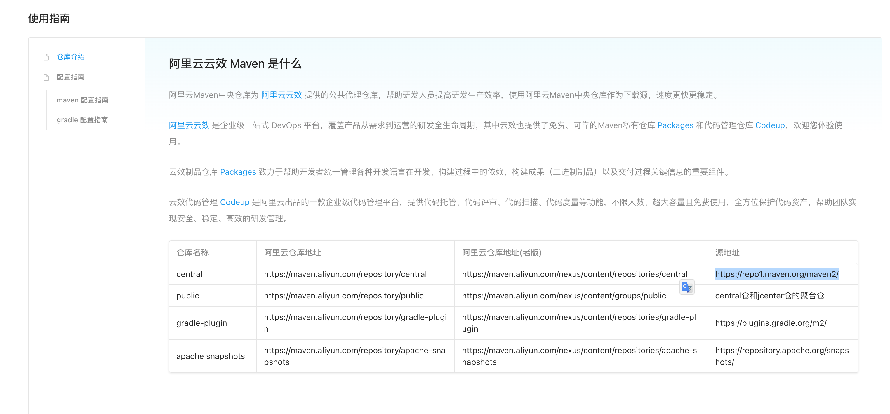
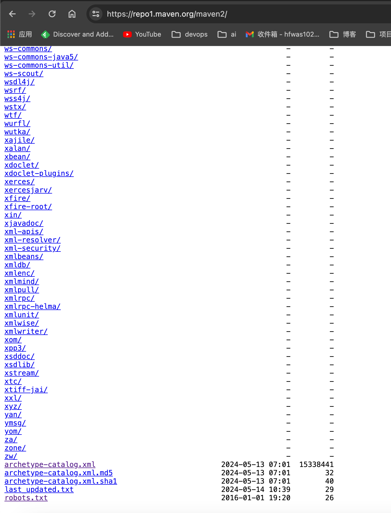
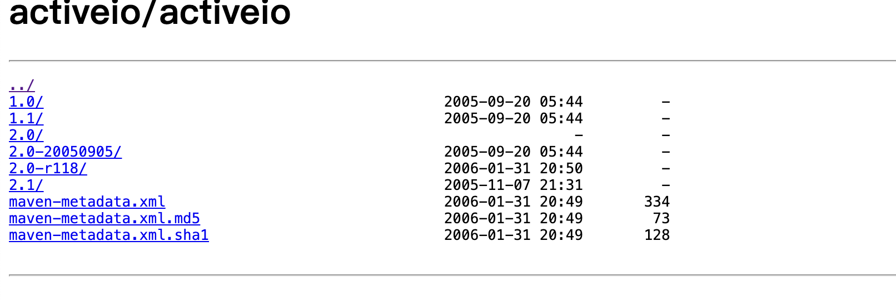

# Nexus操作-下载阿里云maven仓库依赖

## 云效仓库

- 阿里云仓库地址主要指的是云效提供的中央仓库，[可以访问这个地址来访问](https://developer.aliyun.com/mvn/guide)



- 在这个页面我们可以找到云效依赖的源地址： `https://repo1.maven.org/maven2/`



- 熟悉的同学看到这个页面结构和内容应该不陌生了，以及我们熟悉的archetype-catalog.xml  和robots.txt 两个文件

## 文件archetype-catalog.xml

- 我们下载下来archetype-catalog.xml文件，查看内容可以发现文件当中标准的xml内容格式，和maven项目当中的pom.xml当中的depency 标签内容非常详细，
- 再仔细查看，文件内容长达362940行，基本是云效仓库当中所有依赖对应的所有版本依赖，基于这个文件，我们可以获取依赖对应的路径和版本列表

```xml
<?xml version="1.0" encoding="UTF-8"?>
<archetype-catalog>
  <archetypes>
    <archetype>
      <groupId>am.ik.archetype</groupId>
      <artifactId>elm-spring-boot-blank-archetype</artifactId>
      <version>0.0.3</version>
      <description>Blank multi project for Spring Boot + Elm</description>
    </archetype>
    <archetype>
      <groupId>am.ik.archetype</groupId>
      <artifactId>elm-spring-boot-blank-archetype</artifactId>
      <version>0.0.2</version>
      <description>Blank multi project for Spring Boot + Elm</description>
    </archetype>
    <archetype>
      <groupId>am.ik.archetype</groupId>
      <artifactId>elm-spring-boot-blank-archetype</artifactId>
      <version>0.0.1</version>
      <description>Blank multi project for Spring Boot + Elm</description>
    </archetype>
    <archetype>
      <groupId>am.ik.archetype</groupId>
      <artifactId>graalvm-blank-archetype</artifactId>
      <version>0.1.3</version>
      <description>Blank project for GraalVM</description>
    </archetype>
    <archetype>
      <groupId>am.ik.archetype</groupId>
      <artifactId>graalvm-blank-archetype</artifactId>
      <version>0.1.2</version>
      <description>Blank project for GraalVM</description>
    </archetype>
  <archetypes>  
<archetype-catalog>   
```

- 

## 脚本下载

- 根据archetype-catalog.xml文件内容提取groupId和artifactId和version三个字段内容，
- 然后基于提取出来的内容，本地创建对应的文件目录，
- 下载`groupId/artifactId`下的maven-metadata.xml开头的这几个文件



- 下载`groupId/artifactId/version`下的所有文件
- 脚本内容如下所示：

```bash
#!/bin/bash

# Function to create folders recursively
create_folders_recursive() {
    local current_url="$1"
    local parent_folder="$2"

    # Get webpage content
    local html_content=$(curl -s "$current_url")

    # Parse HTML and extract href content, create folders
    echo "$html_content" | grep -o '<a href=['"'"'"][^"'"'"']*['"'"'"]' | sed -e 's/^<a href=["'"'"']//' -e 's/["'"'"']$//' | while read -r href; do
        # Exclude links returning to the parent directory
        if [[ "$href" != "../" ]]; then
            # Check if href is a folder or a file
            if [[ "$href" == */ ]]; then
                # Remove trailing slash
                local folder_name=$(echo "$href" | sed 's:/$::')
                # Create folder
                local folder_path="$parent_folder/$folder_name"
                folder_path=$(echo "$folder_path" | sed 's:^\./::')

                if [[ ! -d "$folder_path" ]]; then
                    mkdir -p "$folder_path"
                    echo "Created folder: $folder_path"
                else
                    echo "Folder already exists: $folder_path"
                fi

                # Recursively call function for subfolder
                create_folders_recursive "$current_url$href" "$folder_path"
            else
                if [[ ("$href" == *.jar || "$href" == *.jar.sha1 || "$href" == *.pom || "$href" == *.pom.sha1) && "$href" != *-sources.* && "$href" != *-javadoc.* ]]; then
                    # It's a file, ignore
                    local file_path="$parent_folder/$href"
                    file_path=$(echo "$file_path" | sed 's:^\./::')
                    echo "Ignored file: $file_path"
                    echo "parent_folder : $parent_folder"

                    # Construct the URL to download each file type
                    BASE_URL="https://repo1.maven.org/maven2"
                    FILE_URL="${BASE_URL}/${file_path}"

                    if [[ ! -f "$file_path" ]]; then
                        echo "Attempting to download: $parent_folder $file_path"
                        wget -P "$parent_folder" "$FILE_URL"
                        if [[ $? -eq 0 ]]; then
                            echo "Downloaded: $FILE_URL"
                        else
                            echo "Failed to download: $FILE_URL"
                        fi
                    else
                        echo "File already exists: $FILE_PATH"
                    fi
                else
                    # It's a file, but not of the specified types, ignore
                    local file_path="$parent_folder/$href"
                    file_path=$(echo "$file_path" | sed 's:^\./::')
                    echo "Ignored file: $file_path"
                fi
            fi
        fi
    done
}

# Define target URL
url="https://repo1.maven.org/maven2/"

# Create initial folder
mkdir -p maven-aliyun
cd maven-aliyun

# Call recursive function to create folders
create_folders_recursive "$url" .

```

- 