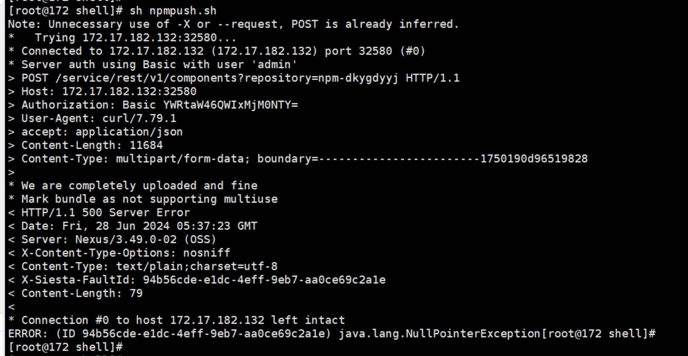
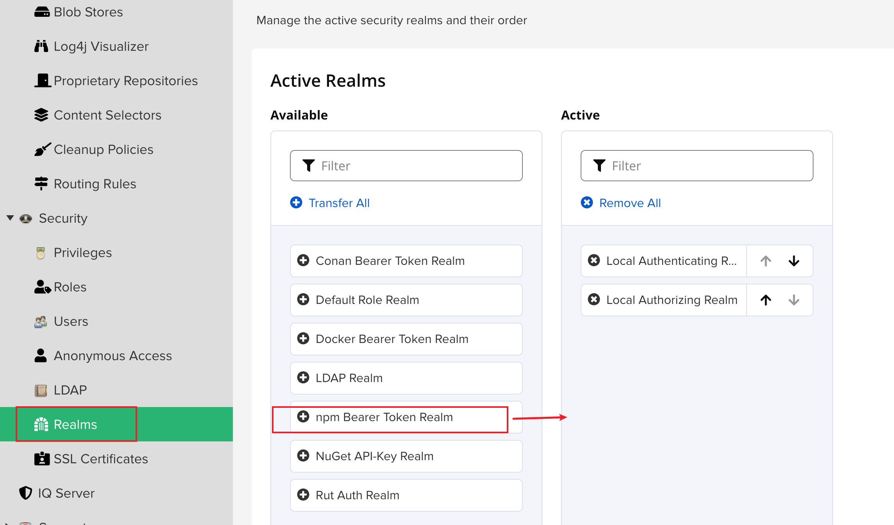
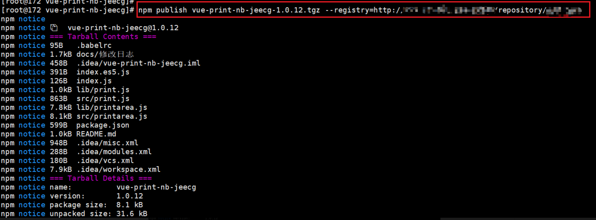

# Nexus操作-手动上传前端依赖

- 执行脚本上传前端依赖的时候遇到了一个问题，从官网下载的npm依赖上传报错空指针异常，报错如下：

- 从npmjs官网下载npm依赖tgz包还是会报空指针异常，这种问题特殊处理
- 首先，开启nexus的认证

- 服务器当中执行`yum install -y nodejs`
- 执行`node -v `和`npm -v `查看是否有正确输出
- 服务器当中执行`npm login --registry=http://nexusip:端口号/repository/前端仓库名称`
- 执行`npm publish vue-print-nb-jeecg-1.0.12.tgz --registry=http://nexusip:端口/repository/前端仓库名称`

- 手动上传完成！！